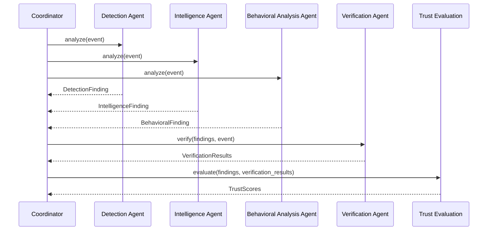

# Agent Design

This document describes the design principles, patterns, and implementation approach for the project's agents. It extends `docs/architecture/AGENT_SPECIFICATION.md` (which defines each agent's role) with how agents are built.

## Design Principles

1. **Simplicity first.** Each agent is a plain Python class, not an enterprise microservice. The implementation should be as straightforward as possible for three students to build, understand, and defend.

2. **Shared interface.** All agents implement the same base interface, making them interchangeable from the Coordinator's perspective.

3. **Structured output.** Every agent produces a Pydantic-validated structured finding, not free-form text. This enables reliable downstream processing by Verification and Trust Evaluation.

4. **Evidence-grounded.** Every agent must cite specific evidence from the input event that supports its conclusion. Claims without evidence are treated as low-confidence.

5. **Honest uncertainty.** Agents must express confidence levels rather than forcing a single unqualified answer. "I don't know" is a valid output.

6. **Separation of analysis and action.** Agents analyze — they never act. All downstream actions are simulated.

## Agent Base Class

All agents inherit from a common base class that enforces the standard interface:

```python
from abc import ABC, abstractmethod
from pydantic import BaseModel

class AgentFinding(BaseModel):
    """Standard output schema for all agents."""
    agent: str                    # Agent identifier
    classification: str           # Classification label or assessment
    evidence: str                 # Cited evidence from the input
    confidence: str               # "high", "medium", "low", or "none"
    reasoning: str                # Brief explanation of the conclusion

class BaseAgent(ABC):
    """Abstract base class for all agents."""

    @abstractmethod
    def analyze(self, event: dict) -> AgentFinding:
        """Analyze a security event and return a structured finding."""
        pass

    @abstractmethod
    def get_prompt(self, event: dict) -> str:
        """Generate the role-specific prompt for this agent."""
        pass
```

> **Note:** This is an illustrative design — not final code. The exact schema and class hierarchy will be determined during implementation.

## Prompt Engineering Approach

Each agent uses a role-specific system prompt that:

1. **Defines the role** — what the agent is responsible for analyzing.
2. **Specifies the output format** — the exact JSON structure expected.
3. **Sets evidence requirements** — the agent must cite specific input data.
4. **Defines uncertainty behavior** — how to express confidence and handle ambiguity.
5. **Sets boundaries** — what the agent should NOT do (e.g., fabricate evidence, make action recommendations).

### Prompt Template Structure

```
SYSTEM PROMPT:
  You are a [ROLE] agent in a cybersecurity analysis system.

  Your task: [SPECIFIC TASK DESCRIPTION]

  You MUST:
  - [Requirement 1: cite evidence]
  - [Requirement 2: express confidence]
  - [Requirement 3: output format]

  You MUST NOT:
  - [Constraint 1: do not fabricate evidence]
  - [Constraint 2: do not recommend real actions]

  Output your analysis as JSON in the following format:
  {
    "classification": "...",
    "evidence": "...",
    "confidence": "high|medium|low|none",
    "reasoning": "..."
  }

USER PROMPT:
  Analyze the following security event:
  [EVENT DATA]
```

### Prompt Separation

To reduce prompt injection risk (see `docs/THREAT_MODEL.md`):

- The **system prompt** (agent instructions) is kept separate from the **user prompt** (event data to analyze).
- Event data is treated as data to analyze, not as instructions to follow.
- Agents are instructed not to follow any instructions found within the event data itself.

## Agent Communication Protocol

Agents do not communicate directly with each other. All communication flows through the Coordinator:



Key properties:
- **Independent analysis.** Detection, Intelligence, and Behavioral Analysis agents run independently on the same event, so their findings are not biased by each other.
- **Sequential verification.** Verification runs after all agents have produced findings.
- **Single trust evaluation.** Trust evaluation runs once, after verification, combining all inputs into trust scores.

## Error Handling Patterns

### Invalid Output

If an agent's LLM call returns output that cannot be parsed into the expected Pydantic schema:

1. Log the raw output and the parsing error.
2. Return a finding with `confidence: "none"` and a note that parsing failed.
3. Trust Evaluation treats this as a low-trust finding.

### LLM API Failure

If the LLM API call fails (timeout, rate limit, error):

1. Retry once after a short delay.
2. If retry fails, return a finding with `confidence: "none"` and a note that the API call failed.
3. Log the error with sufficient detail for debugging.
4. Do not silently skip the agent — its absence should be visible in the final recommendation.

### Missing Data

If an agent requires data that is not available (e.g., Intelligence Agent has no threat intel data for the given indicators):

1. Report "no data available" explicitly — do not default to "benign" or "anomalous."
2. Set confidence appropriately (typically "low" or "none").
3. Include a clear explanation in the reasoning field.

## Phase 1 → Phase 2 Transition

The agent design supports a clean Phase 1 → Phase 2 transition:

1. **Phase 1:** All agents call the same base LLM through the shared `LLM Client`.
2. **Phase 2:** The agent(s) selected for fine-tuning (TO BE DECIDED — see `docs/DECISIONS.md`, D-010) are configured to use the fine-tuned model instead.
3. **No code changes in the agent logic.** Only the model reference changes — the prompts, output parsing, and downstream processing remain the same.
4. **Comparison.** Running the same scenarios through Phase 1 and Phase 2 configurations produces directly comparable results.

## Per-Agent Design Notes

See `docs/architecture/AGENT_SPECIFICATION.md` for the full specification of each agent's inputs, outputs, evidence requirements, failure behavior, and uncertainty behavior.

### Detection Agent
- Simplest classification task — "what type of event is this?"
- Likely the most straightforward to implement and test.
- Good candidate for fine-tuning experiments (but not assumed — see D-010).

### Intelligence Agent
- Requires a local threat intelligence dataset (source TO BE DECIDED).
- "No match" is not the same as "benign" — this distinction must be preserved.
- Dataset quality directly affects this agent's utility.

### Behavioral Analysis Agent
- Requires historical baseline data for the entity in question (source and format TO BE DECIDED).
- Must handle the case where no baseline exists for an entity.
- Anomaly detection is subjective — confidence expression is important.

### Verification Agent
- Checks other agents' findings against cited evidence — does not re-classify the event.
- May be implemented as plain code (not LLM) in Phase 1 for reliability.
- Its own reliability is a known limitation, not something this project claims to fully solve.

## Open Design Questions

These require team decisions before implementation:

- Exact prompt templates for each agent.
- Whether to use Python `asyncio` for parallel agent execution or simple sequential calls.
- Whether the Verification Agent should be LLM-based or rule-based in Phase 1.
- Output format details (exact JSON schema fields beyond the illustrative example above).
- Whether agents should have access to each other's findings before Verification (current design: no).
