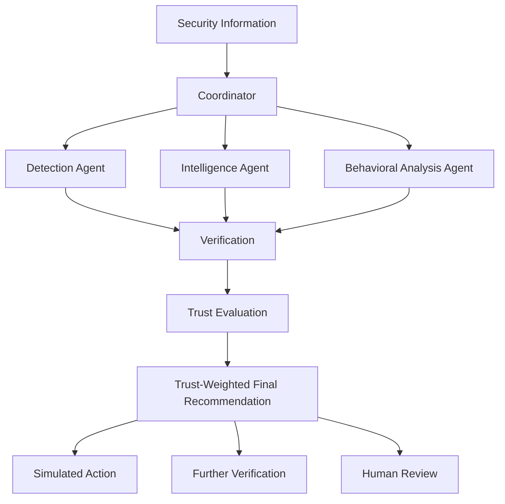

# Architecture

## Architecture Goals

- Simple enough for three students to build, understand, and defend.
- Learning-first: prefer a plain Python module over a distributed system.
- Two-phase compatible: Phase 2 extends Phase 1 without a rebuild.
- Clear separation between logical agent responsibilities and physical implementation (one model/service can serve multiple logical agents).

## High-Level Architecture



**Status: PROPOSED** — the team has not yet approved the final shape of this diagram; it reflects the current documented concept.

## System Flow

1. A security event (log, alert, or email) enters the system as Security Information.
2. The Coordinator dispatches it to the specialized agents.
3. Each agent produces a structured finding (classification + evidence + confidence).
4. Verification checks each finding for consistency with its cited evidence, producing a result: verified consistent, verified inconsistent, or inconclusive.
5. Trust Evaluation combines the verification result with each agent's historical accuracy and agreement with trusted peers to produce a trust score, and weights findings accordingly. Verification result is used **once**, as one input to the trust score — it is not applied a second time elsewhere in the decision.
6. A Trust-Weighted Final Recommendation is produced.
7. The recommendation routes to one of: a **simulated** action, further verification, or human review. The system never executes a real action against live infrastructure.

## Components

| Component | Responsibility | Status |
|---|---|---|
| Coordinator | Dispatches events to agents, collects findings | DECIDED (role) / PROPOSED (implementation) |
| Detection Agent | Classifies the security event | DECIDED (role) |
| Intelligence Agent | Correlates event against threat intelligence data | DECIDED (role) |
| Behavioral Analysis Agent | Compares event against historical behavior baseline | DECIDED (role) |
| Verification | Checks findings for consistency with evidence; feeds Trust Evaluation | DECIDED (role) |
| Trust Evaluation | Scores agents (using verification result, historical accuracy, peer agreement) and weights their findings | DECIDED (concept) / TO BE DECIDED (formula details) |
| Final Recommendation | Produces the system's trust-weighted output and routing decision | DECIDED (concept) |

See `docs/architecture/AGENT_SPECIFICATION.md` for full per-agent detail.

## LLM Role

- **Phase 1:** all agents use a normal/base LLM (no fine-tuning). The specific base model is **TO BE DECIDED** by the team based on available hardware.
- **Phase 2:** one or more agents use a fine-tuned open-source LLM (parameter-efficient fine-tuning — LoRA/QLoRA to be investigated). **Which agent(s) use the fine-tuned model is TO BE DECIDED** — this will depend on dataset availability, hardware, training feasibility, time, student skill level, experimental design, and educational value. No document should assume a specific agent (e.g., Detection) is fine-tuned by default.

## Phase 1 Architecture

Base/normal LLM powering all four logical agent roles. Implementation may be as simple as one LLM client called with four different role-specific prompts — separate models/services are not required unless justified. Verification and Trust Evaluation are implemented as plain code (not LLM calls) unless the team decides otherwise.

## Phase 2 Architecture

Same structure as Phase 1. The base LLM used by one or more agents (not yet decided which) is replaced or supplemented by a fine-tuned model. No other architectural component changes. This allows a direct Phase 1 vs. Phase 2 comparison.

## Verification and Trust — Conceptual Flow

To avoid double-counting verification, the system uses this single, linear flow:

```
Agent Findings
      ↓
Verification (produces: verified consistent / verified inconsistent / inconclusive)
      ↓
Trust Evaluation (combines: historical accuracy + verification result + peer agreement)
      ↓
Trust Score
      ↓
Trust-Weighted Final Recommendation
```

Verification result is **one input** to the trust score, applied once. It must not be used again as a separate, additional weight elsewhere in the decision path. Full detail in `docs/architecture/TRUST_MODEL.md`.

## Final Recommendation

Produced by combining agent findings, weighted by current trust scores, into a single classification and confidence. The recommendation includes a routing suggestion: simulated action, further verification, or human review. Exact routing rules are **TO BE DECIDED**.

## Human Escalation

Any final recommendation below an agreed confidence/trust threshold, or involving an agent recently flagged as unreliable, should be routable to human review rather than a simulated action. Threshold values are **TO BE DECIDED**.

## Component Relationships

- Coordinator → all specialist agents (Detection, Intelligence, Behavioral Analysis): one-way dispatch.
- Specialist agents → Verification: findings + evidence.
- Verification → Trust Evaluation: pass/fail/inconclusive results per finding.
- Trust Evaluation → Final Recommendation: trust-weighted findings.
- Final Recommendation → output layer (dashboard/report — implementation **TO BE DECIDED**).

## Error / Uncertainty Handling

- An agent that fails to produce a valid structured output should be treated as low-confidence/low-trust for that event, not silently ignored or silently trusted.
- Conflicting agent findings should be surfaced, not hidden — the Final Recommendation should be able to state that agents disagreed.
- The system must not claim certainty it does not have; uncertain cases should be routed toward human review rather than forced into a confident answer.

## Safety Note

Every path out of Final Recommendation that could be construed as an "action" is a **simulated action only**. This system does not execute real responses against live infrastructure. See `docs/THREAT_MODEL.md`.
