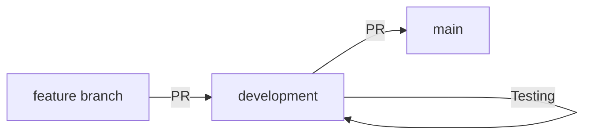

# Development Guide

This guide covers everything a team member needs to set up, develop, and contribute to the project.

## Prerequisites

| Requirement | Version | Purpose |
|---|---|---|
| Python | 3.11+ | Core language |
| pip | Latest | Package management |
| Git | Latest | Version control |
| A code editor | Any (VS Code recommended) | Development |
| GPU (Phase 2 only) | NVIDIA with 8+ GB VRAM | Fine-tuning |

### Optional

| Requirement | Purpose |
|---|---|
| CUDA Toolkit | GPU acceleration for fine-tuning |
| Docker | Containerized development (not required) |

## Environment Setup

### 1. Clone the Repository

```bash
git clone https://github.com/<org>/trust-aware-cyber-defense.git
cd trust-aware-cyber-defense
```

### 2. Create a Virtual Environment

```bash
# Create virtual environment
python -m venv venv

# Activate it
# On Windows:
venv\Scripts\activate
# On macOS/Linux:
source venv/bin/activate
```

### 3. Install Dependencies

```bash
# Install project dependencies
pip install -r requirements.txt

# For development (includes testing tools)
pip install -r requirements-dev.txt
```

### 4. Configure Environment Variables

Create a `.env` file in the project root (this file is gitignored):

```bash
# .env — DO NOT COMMIT THIS FILE

# LLM API Configuration
LLM_API_KEY=your-api-key-here
LLM_MODEL=gpt-3.5-turbo  # or whichever base model the team selects

# Optional settings
LOG_LEVEL=INFO
DATA_DIR=./data
```

> **Security:** Never commit API keys or credentials to the repository. The `.env` file should be listed in `.gitignore`.

### 5. Verify Setup

```bash
# Run tests to verify everything is working
pytest

# Check Python version
python --version

# Check installed packages
pip list
```

## Project Structure

See `docs/SYSTEM_ARCHITECTURE.md` for the complete project structure diagram.

Key directories:

| Directory | Purpose |
|---|---|
| `src/` | Application source code |
| `src/agents/` | Agent implementations |
| `src/coordinator/` | Event dispatch and orchestration |
| `src/trust/` | Trust evaluation and history |
| `src/recommendation/` | Final recommendation logic |
| `src/models/` | Pydantic data models |
| `src/utils/` | Shared utilities (LLM client, etc.) |
| `tests/` | Test suite |
| `data/` | Data files (events, threat intel, baselines) |
| `docs/` | Documentation |
| `experiments/` | Experiment results |

## Development Workflow

### 1. Pick a Task

- Check the team's task board or issue tracker.
- Understand what you're building and how it fits into the architecture.
- Read relevant documentation (see `AGENTS.md` — "Before Any Task").

### 2. Create a Branch

```bash
# Make sure you're on development and up to date
git checkout development
git pull origin development

# Create a feature branch
git checkout -b feature/your-feature-name
```

Use the branch naming conventions in `CONTRIBUTING.md`.

### 3. Implement

- Write code following the project's coding standards.
- Keep changes focused — one feature or fix per branch.
- Write tests for important functionality.
- Run tests frequently during development.

### 4. Test

```bash
# Run all tests
pytest

# Run specific tests
pytest tests/unit/test_trust_model.py

# Run with verbose output
pytest -v

# Run with coverage
pytest --cov=src --cov-report=term-missing
```

### 5. Commit

```bash
# Stage changes
git add <files>

# Commit with a descriptive message
git commit -m "feat: implement detection agent prompt template"
```

Follow the commit message conventions in `CONTRIBUTING.md`.

### 6. Push and Create PR

```bash
# Push your branch
git push origin feature/your-feature-name
```

Then create a Pull Request on GitHub targeting `development`. Fill in the PR template.

### 7. Review and Merge

- Wait for at least one team member to review your PR.
- Address any feedback.
- Merge after approval.

## Coding Standards

### Python Style

- Follow PEP 8 conventions.
- Use type hints for function signatures.
- Maximum line length: 100 characters (flexible for readability).
- Use descriptive variable and function names.

### Data Models

- Use Pydantic `BaseModel` for all structured data.
- Define models in `src/models/`.
- Validate inputs at module boundaries.

### Error Handling

- Catch specific exceptions, not bare `except:`.
- Log errors with sufficient context for debugging.
- See `docs/AGENT_DESIGN.md` for agent-specific error handling patterns.

### Logging

```python
import logging

logger = logging.getLogger(__name__)

# Use appropriate log levels
logger.debug("Detailed debugging info")
logger.info("General operational events")
logger.warning("Something unexpected but not fatal")
logger.error("An error occurred", exc_info=True)
```

### Documentation

- Include docstrings for public functions and classes.
- Keep inline comments focused on "why," not "what."
- Update documentation when changing functionality.

## Running the System

### Phase 1 (Base LLM)

```bash
# Run the system on a sample event
python -m src.main --event data/events/sample_event.json

# Run in verbose mode
python -m src.main --event data/events/sample_event.json --verbose
```

### Phase 2 (Fine-Tuned LLM)

```bash
# Run with the fine-tuned model
python -m src.main --event data/events/sample_event.json --model fine-tuned

# Or specify the adapter path
python -m src.main --event data/events/sample_event.json --adapter-path ./models/lora-adapter
```

> **Note:** These commands are illustrative. The actual CLI interface will be defined during implementation.

## Git Workflow Summary



- **Never push directly to `main`.**
- **Never merge directly into `main`.**
- All work goes through `development` first.

See `docs/DECISIONS.md` (D-009) for the full branching model.

## Useful Commands

```bash
# Check current branch
git branch

# See commit history
git log --oneline -10

# See what's changed
git status
git diff

# Stash work in progress
git stash
git stash pop

# Update your branch from development
git checkout development
git pull origin development
git checkout feature/your-feature
git merge development
```

## Troubleshooting

### Common Issues

| Problem | Solution |
|---|---|
| `ModuleNotFoundError` | Make sure the virtual environment is activated and dependencies are installed |
| LLM API timeout | Check your API key and network connection; the provider may be rate-limiting |
| Test failures after pull | Run `pip install -r requirements.txt` to pick up new dependencies |
| Merge conflicts | Sync your branch with `development` regularly |
| GPU not detected (Phase 2) | Check CUDA installation and driver version |

## Related Documentation

- `CONTRIBUTING.md` — Contribution process and guidelines
- `AGENTS.md` — Rules for AI and human contributors
- `docs/SYSTEM_ARCHITECTURE.md` — Technical architecture and project structure
- `docs/TESTING.md` — Testing strategy and how to run tests
- `docs/DECISIONS.md` (D-007) — Technology stack
- `docs/DECISIONS.md` (D-009) — Git branching model
