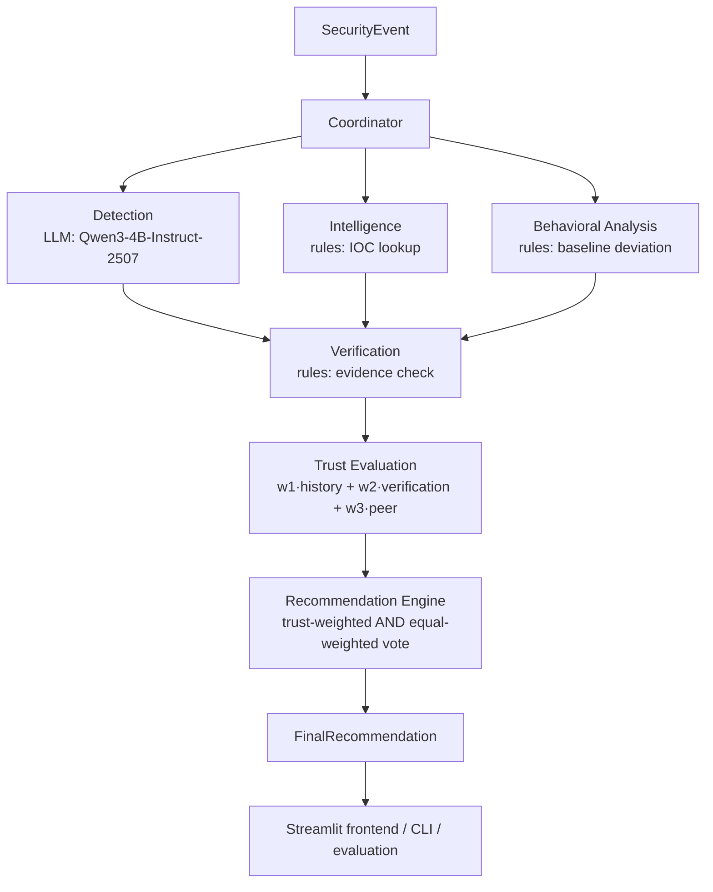

# Phase 1 Implementation (Baseline)

Status: **IMPLEMENTED on `feature/phase-1-baseline` — pending review.** This document is the source of truth for how the Phase 1 baseline actually works. It records every technical decision made to complete Phase 1 (§17), and it distinguishes implementation choices from open research questions.

> **No Qwen3-4B-Instruct-2507 results exist yet.** The development environment used to build this branch had no GPU and no access to model hosts, so the base model could not be run. Every pipeline stage was tested end to end with a clearly labelled **stub** Detection model (`stub:always-normal`). §14 lists exactly which numbers are real and which are stub-only. The commands in §12 produce the real baseline on a machine that can serve the model.

## 1. Locked Team Decisions (not changed here)

| # | Decision |
|---|---|
| 1 | Primary Detection dataset: **UNSW-NB15** (official training/testing partition files) |
| 2 | Base LLM: **Qwen3-4B-Instruct-2507** (`Qwen/Qwen3-4B-Instruct-2507`) |
| 3 | Fine-tuning target: **Detection agent only** (Phase 2) |
| 4 | Metrics: **Macro-F1, schema-valid output rate, evidence grounding rate, trust impact rate** |

These resolve D-007's `LLM_MODEL` and D-010 in `docs/DECISIONS.md`.

## 2. Architecture



The Coordinator runs Detection → Intelligence → Behavioral Analysis **in that order but independently**: no agent sees another's finding (DATA_FLOW.md). Each agent's `AgentFinding` is the inter-agent message, and the Coordinator is the only component that passes it on. There are no agent-to-agent calls, no framework, no database and no HTTP layer; the frontend calls `src.api.analyze_event()` in-process.

| Component | Location |
|---|---|
| Schemas | `src/models/` |
| Configuration | `src/config.py` (environment variables, no secrets in code) |
| Model invocation | `src/utils/llm_client.py` |
| Prompts shared by runtime and fine-tuning data | `src/agents/prompts.py` |
| Agents | `src/agents/{detection,intelligence,behavioral,verification}.py` |
| Trust | `src/trust/trust_model.py`, `src/trust/trust_history.py` |
| Final recommendation | `src/recommendation/recommender.py` |
| Orchestration | `src/coordinator/coordinator.py`, `src/pipeline.py` |
| Backend API for the frontend | `src/api.py` |
| UNSW-NB15 pipeline | `src/data/unsw_nb15.py` |
| Evaluation | `src/evaluation/metrics.py`, `src/evaluation/runner.py` |
| CLI | `src/cli.py` |
| Frontend | `frontend/app.py`, `frontend/view.py` |
| Reference data (SYNTHETIC, committed) | `data/threat_intel/`, `data/baselines/`, `data/events/` |
| Frozen subsets (committed id lists) | `data/eval/` |

### Why Intelligence and Behavioral are rule-based

ARCHITECTURE.md allows "one LLM client called with role-specific prompts" but does not require every role to be an LLM. Intelligence is a lookup, and Behavioral is a numeric comparison against a baseline. An LLM would add cost and hallucination risk without adding information.

Keeping them deterministic also keeps the Phase 1 → Phase 2 comparison clean. Detection is the only LLM agent, and it is the only agent that changes in Phase 2, so any difference is attributable to fine-tuning (D-005).

The multi-agent trust question is unaffected: trust weighs three heterogeneous agents with measured reliabilities. **This is flagged for the team's confirmation in §16.**

## 3. Schemas (`src/models/`)

The contract is M1's finalized schema from PR #8 (`docs/API_REFERENCE.md` on `docs/day2-architecture-schemas`), which also matches the frontend fixtures. It is implemented with three deliberate differences, all additive and all flagged in the PR:

1. `SecurityEvent.source_ip` / `destination_ip` are `IPvAnyAddress`, not `str`. PR #8 claimed IP typing but did not implement it.
2. `AgentFinding.model: Optional[str]` records the engine that produced each finding.
3. `FinalRecommendation.agent_models: Dict[str, str]` records the per-agent engines. `model` is kept as a summary string.

Items 2 and 3 make a Detection-only Phase 2 representable (review finding "per-agent model identity").

### Shared types

| Type | Values |
|---|---|
| `Verdict` | `malicious`, `suspicious`, `benign`, `unknown` (`unknown` = abstain) |
| `Confidence` | `high`, `medium`, `low`, `none` |
| `VerificationStatus` | `verified_consistent`, `verified_inconsistent`, `inconclusive` |
| `Routing` | `simulated_action`, `further_verification`, `human_review` |
| `AgentName` | `detection`, `intelligence`, `behavioral` |

### Input: `SecurityEvent`

| Field | Required | Validation / meaning |
|---|---|---|
| `event_id` | yes | 1–64 chars |
| `timestamp` | yes | ISO 8601 datetime. UNSW-NB15 partition files have none, so they use `1970-01-01T00:00:00Z` plus a `metadata.timestamp_note` |
| `event_type` | yes | non-empty, e.g. `network_flow` |
| `raw_content` | yes | 1–10,000 chars, untrusted. For flows: `name=value, …` of the 14 Detection features |
| `source_ip`, `destination_ip` | no | valid IPv4/IPv6 |
| `destination_port` | no | 0–65535 |
| `protocol`, `entity` | no | strings. `entity` selects an entity baseline |
| `metadata` | no | provenance (`source`, `split`, `record_id`), optional `indicators` (`ips`/`domains`/`hashes` lists), and `ground_truth` for evaluation. **No agent reads `ground_truth`.** |

### Agent output (= inter-agent message): `AgentFinding`

`verdict`, `classification`, `evidence`, `confidence` and `reasoning` are produced by the agent (for Detection, generated by the model). `agent`, `event_id`, `model` and `error` are set by code.

`evidence` is **always** a comma-separated list of `field=value` pairs copied from the event, so it can be checked mechanically. `error` is set only when the agent failed. A failed agent returns `verdict: unknown` and `confidence: none`.

| Agent | Receives | Produces |
|---|---|---|
| Detection | `SecurityEvent` (via the fine-tuning prompt, §6) | `verdict` benign/malicious/suspicious/unknown; `classification` one of the 10 UNSW-NB15 classes (the model may emit others; they are scored as invalid) |
| Intelligence | `SecurityEvent` (IPs, `metadata.indicators`) | `malicious` + `known_malicious_indicator`, or `unknown` + `no_match` / `no_indicators` |
| Behavioral Analysis | `SecurityEvent` (`raw_content` fields, `entity`) | `suspicious` + `baseline_deviation`, or `unknown` + `within_baseline` / `no_baseline` / `no_comparable_fields` |
| Verification | all findings + the event | one `VerificationResult` per finding |

### Final output: `FinalRecommendation`

Contains:
- identity: `run_id`, `event_id`, `phase`, `model`, `agent_models`, `created_at`, `is_mock`
- decision: `verdict`, `classification`, `confidence`, `confidence_value`, `routing`, `routing_reason`, `simulated_action` (`executed` is always `False`)
- evidence trail: `agent_findings`, `verification_results`, `trust_scores`
- trust impact: `trust_weighted`, `equal_weighted`, `trust_changed_outcome`
- explanation: `disagreement_summary`, `reasoning`

## 4. Agents

**Detection** (`src/agents/detection.py`)
- Sends system = `DETECTION_INSTRUCTION` and user = `"Analyze this network security event:\n" + raw_content`.
- Parses the first JSON object in the reply (tolerating code fences and `<think>` blocks) into the five model fields. Extra keys are rejected.
- On an unparseable reply it retries **once** with a reminder. After two failures, or on a server error, it returns an error finding.
- It records a per-event trace (raw responses, first-attempt validity), which evaluation uses.

**Intelligence** (`src/agents/intelligence.py`)
- Looks up `source_ip`, `destination_ip` and `metadata.indicators` in `data/threat_intel/ioc_synthetic.json` (SYNTHETIC, RFC 5737 ranges).
- A match gives `malicious` / `high` and cites the matched field.
- No match, or no indicators, gives an **abstention**. "No match" is never "benign".
- UNSW-NB15 partition records carry no IPs, so on the evaluation set this agent always abstains. That is expected, not a failure.

**Behavioral Analysis** (`src/agents/behavioral.py`)
- Chooses a baseline:
  1. the entity baseline (`data/baselines/entities_synthetic.json`), if the event has a known `entity`
  2. otherwise the **(proto, service) normal-traffic profile** learned from **train-split Normal records only**
  3. otherwise it abstains
- Profiles hold the 1st–99th percentile of 9 numeric features and the set of observed `state` / `sttl` / `dttl` values, for pairs with at least 30 normal records (9 profiles on the official data).
- ≥2 deviating features gives `suspicious` (medium confidence; ≥4 gives high) and cites the deviating fields. Otherwise it **abstains** (`within_baseline`).
- Rationale, measured on the **validation** calibration subset: "suspicious" votes were right 18/20 times, while "within baseline → benign" votes were right only 17/136 times. Most attack flows look normal on these features, and "no anomaly" is not evidence of benign (AGENT_SPECIFICATION).

**Verification** (`src/agents/verification.py`): rule-based, never re-classifies. See §8.

## 5. UNSW-NB15 Pipeline (`src/data/unsw_nb15.py`, `python -m src.cli prepare-data`)

**Source:** place the official `UNSW_NB15_training-set.csv` (175,341 rows) and `UNSW_NB15_testing-set.csv` (82,332 rows) from https://research.unsw.edu.au/projects/unsw-nb15-dataset in `data/raw/unsw_nb15/`. They are never committed. Cite Moustafa & Slay (2015).

| Aspect | Decision |
|---|---|
| Relevant features (model input) | 14 raw features: `dur, proto, service, state, spkts, dpkts, sbytes, dbytes, rate, sttl, dttl, sload, dload, tcprtt` |
| Irrelevant / excluded from input | `id` (row id), `label` and `attack_cat` (targets), and the other 30 columns (`ct_*` counters, windows, jitter, means, etc.), which are kept in the CSV splits for audit only |
| Categorical handling | `proto`, `service`, `state` kept as their original strings (`service="-"` means none); no encoding, since the LLM reads text |
| Numerical handling | **Raw, unscaled values** as written by pandas. No z-scoring: an LLM needs meaningful quantities. (Some values render in scientific notation; kept for parity with the dataset PR.) |
| Missing values | None in the official files. A row missing any Detection feature would be dropped; an invalid `label` row is dropped |
| Label mapping | `label` 0 → `benign` / `Normal`; 1 → `malicious` / `attack_cat`. `label` and `attack_cat` must agree, or the pipeline fails |
| Class handling | 10 classes kept. No resampling of the splits; the evaluation subset is class-stratified (≤50 per class) so Macro-F1 is meaningful |
| Deduplication | On the 14 features + targets, within each official file (~50% of training rows and ~44% of test rows are duplicates after feature reduction) |
| Leakage prevention | (1) dedup before splitting; (2) training records whose model input appears in the test file are removed (2,730); (3) train/validation split by input group; (4) the pipeline asserts zero shared inputs across splits |
| Train/validation/test | Test = official testing file (deduplicated only, never re-split). Validation = ~10% of input groups per `attack_cat`, stratified, seed 42. Train = the rest |
| Reproducibility | Deterministic: re-running gives byte-identical JSONL; the subset id lists are frozen and verified on every run |

**Output on the official files** (verified):

| Split | Records | Notes |
|---|---|---|
| train | 76,621 | fine-tuning source (Phase 2) |
| validation | 8,525 | calibration subset: 192 events (≤20/class) |
| test | 45,782 | evaluation subset: 494 events (50/class; Worms 44) |

sha256 of the fine-tuning JSONL: train `32cd1964…`, validation `6f3232fc…`, test `8a28ab39…`. These are identical to the dataset-fix branch `fix/day2-dataset-leakage-and-schema`, so both implementations agree byte for byte.

**Generated files** (gitignored):
- `data/splits/{train,validation,test}.{csv,jsonl}`
- `data/processed/behavioral_profiles.json`
- `data/processed/{eval,calibration}_events.jsonl`
- `data/processed/prepare_summary.json`

`python -m src.cli validate-data` is the gate. It exits 1 on empty or missing splits, schema or feature-order errors, ungrounded evidence, or any cross-split overlap.

## 6. Qwen3-4B-Instruct-2507 Integration

- **Interface:** `LLMClient.generate(system_prompt, user_prompt) -> str`. Agents depend on nothing else.
- **Implementation:** `OpenAICompatibleClient` uses the OpenAI SDK (D-007) against any OpenAI-compatible server:
  - vLLM: `vllm serve Qwen/Qwen3-4B-Instruct-2507`, then `LLM_BASE_URL=http://localhost:8000/v1` (default)
  - Ollama: `ollama run hf.co/unsloth/Qwen3-4B-Instruct-2507-GGUF:Q4_K_M`, then `LLM_BASE_URL=http://localhost:11434/v1` and `LLM_MODEL=hf.co/unsloth/Qwen3-4B-Instruct-2507-GGUF:Q4_K_M`
- **Parameters:** temperature 0, max_tokens 512, seed 42, timeout 120 s, 2 transport retries. The model is non-thinking only; `<think>` blocks are stripped defensively.
- **Prompt parity:** the Detection prompt is imported by both the agent and the dataset builder (`src/agents/prompts.py`). A test asserts that the runtime system/user messages equal the fine-tuning `instruction`/`input` for the same record. Phase 1 and Phase 2 therefore differ only in the model.
- **Stub:** `StubLLMClient` / `LLM_BACKEND=stub` is a deterministic offline stand-in that always answers "benign / Normal". Its model id starts with `stub:`, results are marked `is_mock: true`, and the frontend shows "mock / stub model".
- **Quantization caveat:** use the same serving stack and quantization for Phase 1 and Phase 2, or the inference setup becomes a hidden variable.

## 7. Trust Methodology (`src/trust/`)

`Trust_i = 0.40 × HistoricalAccuracy_i + 0.35 × Verification_i + 0.25 × PeerAgreement_i`, clipped to [0, 1]. The weights are the API_REFERENCE defaults, and must sum to 1.

| Factor | Implementation |
|---|---|
| Historical accuracy | **Measured**: binary accuracy of the agent's non-abstaining findings on the frozen calibration subset (validation split, never test). Correct means malicious/suspicious on an attack, or benign on normal. Stored per phase and Detection model in `runs/calibration/phase{N}__{backend}__{model}.json`. Agents with no votes keep `initial_trust_score = 0.5` |
| Verification | `verified_consistent` 1.0, `inconclusive` 0.5, `verified_inconsistent` 0.0. This is the only place the verification result is used (TRUST_MODEL.md) |
| Peer agreement | 0 if the agent abstained. Otherwise, the share of the *other* voting agents' historical accuracy that is on the same side (threat = malicious/suspicious, or benign). 0.5 if no other agent voted. It uses historical accuracy, not trust, to avoid a circular definition |

Trust is recomputed per event and not updated online during evaluation, so evaluation results don't depend on event order. Trust is a weighting heuristic, not a probability, and is never displayed as "%".

## 8. Verification Rules (`src/agents/verification.py`)

Applied per finding, first match wins:

1. The agent errored → `inconclusive`.
2. Evidence isn't `field=value` pairs → `verified_inconsistent`.
3. No evidence and an abstention → `inconclusive`.
4. No evidence but a conclusion → `verified_inconsistent`.
5. A cited field is absent from the event, or its value differs (numbers compared numerically, text case-insensitively) → `verified_inconsistent`.
6. Detection only: a known UNSW class contradicts the verdict (`Normal` with a threat verdict, or an attack class with `benign`) → `verified_inconsistent`.
7. Otherwise → `verified_consistent`.

"Checkable facts" are the `raw_content` pairs, the typed event fields and `metadata.indicators`.

**Limitations:** grounding proves that the cited values exist in the event, not that they justify the conclusion. Rule 6 only catches internal contradictions.

## 9. Final Recommendation (`src/recommendation/recommender.py`)

**Two-stage weighted vote.** Abstentions don't vote. Each voter adds its trust score (trust-weighted) or 1.0 (equal-weighted control):
- **Stage 1:** threat (malicious + suspicious) vs benign. A tie gives `unknown`.
- **Stage 2:** within threat, `malicious` wins if its weight ≥ `suspicious`'s.

The two-stage design fixes a real defect found in testing: with a single-stage vote, malicious + suspicious split the threat vote and lost to a single benign vote.

**Confidence:** `confidence_value` = the winning side's share of the trust-weighted vote. Labels: ≥0.75 high, ≥0.55 medium, >0 low, 0 none.

**Routing** (first rule that applies):
1. No winner or a tie → `human_review`.
2. `confidence_value` < 0.60 → `human_review`.
3. Agents disagree and the winner isn't benign → `human_review`.
4. The winner is benign → `further_verification` (no action).
5. Otherwise → `simulated_action`, text "Simulated — would …", `executed: False` (D-011).

**How trust affects the result:** only through the vote weights. `trust_changed_outcome` is true when the trust-weighted and equal-weighted verdicts differ. Both are always returned (Experiment 2 control).

## 10. Evaluation Methodology (`src/evaluation/`, `python -m src.cli evaluate`)

**Test set:** the frozen evaluation subset, 494 UNSW-NB15 **test-split** events (`data/eval/phase1_eval_subset_ids.json`, 50 per class, Worms 44).

**Output:** `runs/<run_id>/`
- `config.json`: effective models, trust history used, parameters (no API key)
- `results.jsonl`: per event, ground truth + full `FinalRecommendation` + Detection trace
- `metrics.json`

Always calibrate before evaluating with the same model. Otherwise every agent uses the default history of 0.5.

| Metric | Definition | Numerator / denominator | Interpretation | Limitations |
|---|---|---|---|---|
| **Macro-F1** (primary) | Unweighted mean of per-class F1 of the **Detection** finding's `classification` vs `attack_cat` over the 10 classes. Case-insensitive exact class names; anything else, or a failed agent, counts as an invalid (wrong) prediction | per class 2PR/(P+R) | Detection quality independent of class imbalance; this is the Phase 1 vs Phase 2 headline | n = 494 (≤50/class): indicative only. Class names must match the UNSW vocabulary |
| **Schema-valid output rate** | Detection replies that parse into the five-field schema **on the first attempt** | first-attempt-valid / Detection calls (= events). The after-retry rate is also reported | Format adherence of the model itself (fine-tuning is expected to affect it) | Parsing tolerates code fences / `<think>`; extra keys are invalid |
| **Evidence grounding rate** | Schema-valid Detection findings that Verification marks `verified_consistent` | consistent / schema-valid (after retry) | How often cited evidence exists in the event (the inverse of hallucinated evidence) | Grounded ≠ correct; rule 6 contradictions also count as not grounded |
| **Trust impact rate** | Events where the trust-weighted verdict ≠ the equal-weighted verdict | changed / events. Also reported: of the changed events, how many each method got right (binary) | How often trust weighting matters, and whether it helps | Depends on calibration quality and on disagreement between agents |

**Secondary diagnostics:** system-level binary macro-F1 (final verdict vs label), routing distribution, and per-agent binary accuracy and abstention.

**Phase 1 vs Phase 2:** use the same subset and the same settings. McNemar's test on paired Detection correctness is the recommended significance check (not implemented in Phase 1).

## 11. Reproducibility

- **Fixed seeds:** split and subsets (42), LLM (seed 42, temperature 0).
- **Frozen subset id lists** are committed and re-verified on every `prepare-data`; drift fails loudly.
- **Byte-identical regeneration** of the splits (§5 hashes).
- **Pinned dependency versions** in `requirements.txt`.
- **Every run writes its effective configuration** and the trust history used.
- **Server-side nondeterminism:** vLLM/Ollama may still produce small differences across hardware; record the server version in the run notes.

## 12. Commands

```bash
python -m venv .venv && source .venv/bin/activate
pip install -r requirements.txt

# Data (after placing the two official CSVs in data/raw/unsw_nb15/)
python -m src.cli prepare-data
python -m src.cli validate-data          # exits 1 on any failure

# Real Phase 1 baseline (serve Qwen first, see §6)
python -m src.cli check-llm
python -m src.cli calibrate              # 192 validation events -> runs/calibration/...
python -m src.cli evaluate               # 494 test events -> runs/phase1-<timestamp>/

# Single event / frontend
python -m src.cli analyze --demo 0
streamlit run frontend/app.py

# Offline (no model server): add --backend stub, or LLM_BACKEND=stub for Streamlit
python -m src.cli --backend stub calibrate && python -m src.cli --backend stub evaluate

# Tests
pytest
```

## 13. Testing (`tests/`, 74 tests)

| Area | File |
|---|---|
| Schema validation (input constraints, enums, `executed` can't be true, frontend fixtures) | `test_schemas.py` |
| Model invocation: JSON extraction, **real OpenAI-protocol call against a local fake server**, unreachable server → `LLMError`, stub labelling | `test_llm_client.py` |
| Agent interfaces: Detection happy / retry / failure / extra-key / server-error paths; **prompt parity with fine-tuning data**; Intelligence match / no-match / no-indicator / metadata; Behavioral abstain / deviation / no-baseline / entity precedence | `test_agents.py` |
| Verification (all 7 rules, 11 cases) | `test_verification.py` |
| Trust formula (exact values), peer-agreement edge cases, two-stage vote, trust-flip scenario, routing, calibration and history loading | `test_trust_and_recommendation.py` |
| Dataset pipeline: synthetic end-to-end (planted overlap and duplicates), determinism, frozen-subset drift detection, validator leakage and empty-split failures, record checks; **real UNSW-NB15 counts** (runs when the official CSVs are present) | `test_unsw_pipeline.py` |
| Metric calculations against hand-computed values | `test_metrics.py` |
| End to end: demo events, invalid input, agent crash isolation, calibrate + evaluate run artifacts | `test_end_to_end.py` |
| Frontend (Streamlit `AppTest`): live pipeline, saved examples, invalid pasted event | `test_frontend.py` |

## 14. Results Obtained in the Development Environment

| Result | Status |
|---|---|
| Data pipeline on the official files (counts, 0 cross-split overlap, hashes) | **Real** |
| Behavioral agent, calibration subset (validation): 20 votes, 18 correct (0.90); abstained 172/192 | **Real** (rule-based, model-independent) |
| Behavioral agent, evaluation subset (test): 29 votes, 29 correct; abstained 465/494 | **Real** (rule-based, model-independent) |
| Intelligence agent: abstains on all UNSW-NB15 events (no IPs in the partition files) | **Real**, expected |
| Four metrics on 494 events with `stub:always-normal` Detection: Macro-F1 0.0184, schema-valid 1.0, grounding 1.0, trust impact 0.0587 (29/494; trust right 29, equal right 0) | **Stub only — pipeline check, NOT a model result** |
| Qwen3-4B-Instruct-2507 baseline metrics | **Not yet obtained** (no model access here) |

## 15. Known Limitations

- **The real Qwen run is outstanding (§14).** Latency on CPU-only hardware may be minutes per event; a GPU (e.g. Colab T4 with vLLM) is recommended.
- **Intelligence always abstains on UNSW-NB15**, so on the evaluation set trust effectively arbitrates between Detection and Behavioral. IOC matching is exercised by the demo events and tests.
- **Behavioral is high-precision but low-coverage** (votes on ~6% of events). Its profiles cover only (proto, service) pairs with ≥30 normal training records.
- **Evaluation n = 494 (≤50/class):** results are indicative, not statistically rigorous (RESEARCH.md).
- **Calibration uses 192 events;** historical accuracy is a small-sample estimate (TRUST_MODEL.md limitation).
- **`TRAINING_CONFIDENCE = "high"`** in the fine-tuning targets is a placeholder: labels carry no confidence.
- **Same-input / different-label records** remain in the splits (reported, not removed).
- **UNSW-NB15 partition files have no timestamps, IPs or ports.** Placeholders are documented.
- **Trust weights (0.40/0.35/0.25), the 0.60 threshold and the confidence cut-offs** are reasonable defaults chosen for Phase 1, not tuned or scientifically validated values.

## 16. Phase 2 Preparation (not implemented)

- **Fine-tuning data:** `data/splits/train.jsonl` / `validation.jsonl`, in the exact prompt format Phase 1 uses. Map to chat as system = `instruction`, user = `input`, assistant = `output`.
- **Integration:** serve the fine-tuned Detection model (merged or adapter) behind an OpenAI-compatible endpoint and run with `PHASE=2 DETECTION_MODEL=<id>`. Only `agent_models["detection"]` changes; no agent code changes.
- **Evaluation:** run `calibrate` and then `evaluate` with the same subset; calibration files are keyed by phase and model.
- **Not done here:** training scripts, LoRA/QLoRA configuration, the training-set size reduction (76k → 2–5k planned), McNemar comparison.
- **Needs human attention:**
  1. Confirm rule-based Intelligence/Behavioral (§2).
  2. Merge order with PRs #7 / #8 and the dataset-fix PR (`scripts/prepare_unsw_nb15.py` duplicates `src/data/unsw_nb15.py`; outputs are byte-identical, so keep one).
  3. Record §17 in `docs/DECISIONS.md` after PR #8 merges.
  4. Run the real baseline.

## 17. Phase 1 Decision Record

| ID | Decision | Rationale |
|---|---|---|
| P1-01 | Implement PR #8's schema + IP typing + per-agent `model` / `agent_models` | M1's finalized contract; frontend fixtures already match it; per-agent identity is needed for a Detection-only Phase 2 |
| P1-02 | Detection = LLM; Intelligence, Behavioral, Verification = rules | Isolates the fine-tuning effect; lookups and threshold checks don't need an LLM (§2) |
| P1-03 | Agents run independently in the order D → I → B | DATA_FLOW / PR #8 independence + requested order |
| P1-04 | UNSW pipeline = the dataset-fix methodology (§5) | Leakage-safe, byte-identical to the reviewed fix |
| P1-05 | Frozen, class-stratified eval (test, 494) and calibration (validation, 192) subsets | Same events for both phases; calibration never touches test |
| P1-06 | OpenAI-compatible client, temperature 0, seed 42, 1 parse retry | D-007 SDK; deterministic; one retry measured separately |
| P1-07 | Shared Detection prompt module for runtime and fine-tuning | Guarantees Phase 1/2 prompt parity (D-005) |
| P1-08 | Evidence = `field=value` pairs; rule-based verification (§8) | Mechanically checkable → grounding metric |
| P1-09 | Trust weights 0.40/0.35/0.25; history from calibration; side-based peer agreement | TRUST_MODEL formula; measured, order-independent |
| P1-10 | Two-stage vote; threshold 0.60; routing rules (§9) | Fixes the split-threat-vote defect; D-011 |
| P1-11 | Behavioral abstains when within baseline | Spec ("not a verdict"); validation precision 17/136 for benign votes |
| P1-12 | Metric definitions (§10) | Measurable, reproducible, with the Phase 2 comparison in mind |
| P1-13 | Streamlit frontend calling `src.api` in-process | D-013 draft (PR #8); no API layer needed |
| P1-14 | Env-var configuration, no secrets in code; pinned requirements | SECURITY.md; reproducibility |
