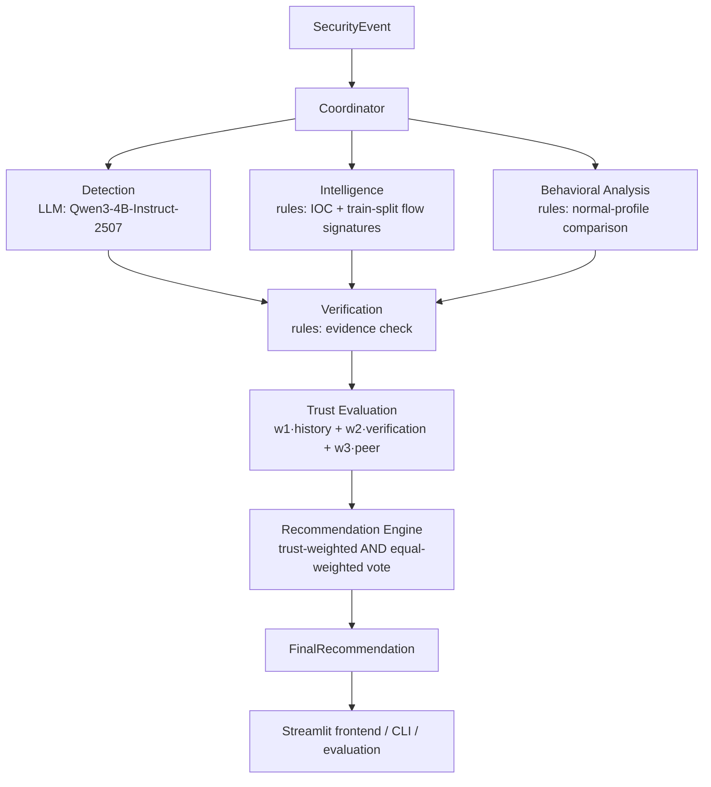

# Phase 1 Implementation (Baseline)

Status: **IMPLEMENTED on `feature/phase-1-baseline` — pending review.** This document is the source of truth for how the Phase 1 baseline actually works. It records every technical decision made to complete Phase 1 (§17), and it distinguishes implementation choices from open research questions.

> **No Qwen3-4B-Instruct-2507 results exist yet.** The development environment used to build this branch had no GPU and no access to model hosts, so the base model could not be run. Every pipeline stage was tested end to end with a clearly labelled **stub** Detection model (`stub:always-normal`). §14 lists exactly which numbers are real and which are stub-only. The commands in §12 produce the real baseline on a machine that can serve the model.

## 1. Locked Team Decisions (not changed here)

| # | Decision |
|---|---|
| 1 | Primary Detection dataset: **UNSW-NB15** (official training/testing partition files) |
| 2 | Base LLM: **Qwen3-4B-Instruct-2507** (`Qwen/Qwen3-4B-Instruct-2507`) |
| 3 | Fine-tuning target: **Detection agent only** (Phase 2) |
| 4 | Metrics: **Macro-F1, schema-valid output rate, evidence grounding rate, trust impact rate** |

These resolve D-007's `LLM_MODEL` and D-010 in `docs/DECISIONS.md`.

## 2. Architecture



The Coordinator runs Detection → Intelligence → Behavioral Analysis **in that order but independently**: no agent sees another's finding (DATA_FLOW.md). Each agent's `AgentFinding` is the inter-agent message, and the Coordinator is the only component that passes it on. There are no agent-to-agent calls, no framework, no database and no HTTP layer; the frontend calls `src.api.analyze_event()` in-process.

| Component | Location |
|---|---|
| Schemas | `src/models/` |
| Configuration | `src/config.py` (environment variables, no secrets in code) |
| Model invocation | `src/utils/llm_client.py` |
| Prompts shared by runtime and fine-tuning data | `src/agents/prompts.py` |
| Agents | `src/agents/{detection,intelligence,behavioral,verification}.py` |
| Trust | `src/trust/trust_model.py`, `src/trust/trust_history.py` |
| Final recommendation | `src/recommendation/recommender.py` |
| Orchestration | `src/coordinator/coordinator.py`, `src/pipeline.py` |
| Backend API for the frontend | `src/api.py` |
| UNSW-NB15 pipeline | `src/data/unsw_nb15.py` |
| Evaluation | `src/evaluation/metrics.py`, `src/evaluation/runner.py` |
| CLI | `src/cli.py` |
| Frontend | `frontend/app.py` (page), `frontend/render.py` (result view), `frontend/view.py` (display helpers) |
| Reference data (SYNTHETIC, committed) | `data/threat_intel/`, `data/baselines/`, `data/events/` |
| Reference data learned from the TRAIN split (generated) | `data/processed/intel_signatures.json`, `data/processed/behavioral_profiles.json` |
| Frozen subsets (committed id lists) | `data/eval/` |

### Why Intelligence and Behavioral are rule-based

ARCHITECTURE.md allows "one LLM client called with role-specific prompts" but does not require every role to be an LLM. Intelligence is a lookup, and Behavioral is a numeric comparison against a baseline. An LLM would add cost and hallucination risk without adding information.

Keeping them deterministic also keeps the Phase 1 → Phase 2 comparison clean. Detection is the only LLM agent, and it is the only agent that changes in Phase 2, so any difference is attributable to fine-tuning (D-005).

The multi-agent trust question is unaffected: trust weighs three heterogeneous agents with measured reliabilities. On UNSW-NB15 all three now contribute votes (§4, audit fix C2). **This is flagged for the team's confirmation in §16.**

## 3. Schemas (`src/models/`)

The contract is M1's finalized schema from PR #8 (`docs/API_REFERENCE.md` on `docs/day2-architecture-schemas`), which also matches the frontend fixtures. It is implemented with three deliberate differences, all additive and all flagged in the PR:

1. `SecurityEvent.source_ip` / `destination_ip` are `IPvAnyAddress`, not `str`. PR #8 claimed IP typing but did not implement it.
2. `AgentFinding.model: Optional[str]` records the engine that produced each finding.
3. `FinalRecommendation.agent_models: Dict[str, str]` records the per-agent engines. `model` is kept as a summary string.

Items 2 and 3 make a Detection-only Phase 2 representable (review finding "per-agent model identity").

4. **Canonical label vocabulary (audit fix C1).** `DETECTION_CLASSES` in `src/models/types.py` (`Normal, Analysis, Backdoor, DoS, Exploits, Fuzzers, Generic, Reconnaissance, Shellcode, Worms`) is the single source of truth for the Detection prompt, the Detection output schema (`DetectionModelOutput`), the dataset pipeline, Verification and evaluation. A test asserts all five are identical.

### Shared types

| Type | Values |
|---|---|
| `Verdict` | `malicious`, `suspicious`, `benign`, `unknown` (`unknown` = abstain) |
| `Confidence` | `high`, `medium`, `low`, `none` |
| `VerificationStatus` | `verified_consistent`, `verified_inconsistent`, `inconclusive` |
| `Routing` | `simulated_action`, `further_verification`, `human_review` |
| `AgentName` | `detection`, `intelligence`, `behavioral` |

### Input: `SecurityEvent`

| Field | Required | Validation / meaning |
|---|---|---|
| `event_id` | yes | 1–64 chars |
| `timestamp` | yes | ISO 8601 datetime. UNSW-NB15 partition files have none, so they use `1970-01-01T00:00:00Z` plus a `metadata.timestamp_note` |
| `event_type` | yes | non-empty, e.g. `network_flow` |
| `raw_content` | yes | 1–10,000 chars, untrusted. For flows: `name=value, …` of the 14 Detection features |
| `source_ip`, `destination_ip` | no | valid IPv4/IPv6 |
| `destination_port` | no | 0–65535 |
| `protocol`, `entity` | no | strings. `entity` selects an entity baseline |
| `metadata` | no | provenance (`source`, `split`, `record_id`), optional `indicators` (`ips`/`domains`/`hashes` lists), and `ground_truth` for evaluation. **No agent reads `ground_truth`.** |

### Agent output (= inter-agent message): `AgentFinding`

`verdict`, `classification`, `evidence`, `confidence` and `reasoning` are produced by the agent (for Detection, generated by the model). `agent`, `event_id`, `model` and `error` are set by code.

`evidence` is **always** a comma-separated list of `field=value` pairs copied from the event, so it can be checked mechanically. `error` is set only when the agent failed. A failed agent returns `verdict: unknown` and `confidence: none`.

| Agent | Receives | Produces |
|---|---|---|
| Detection | `SecurityEvent` (via the fine-tuning prompt, §6) | `DetectionModelOutput`: `verdict` benign/malicious/suspicious/unknown; `classification` **must be** one of the 10 `DETECTION_CLASSES` (case-insensitive, canonicalised). Any other label makes the output schema-invalid |
| Intelligence | `SecurityEvent` (IPs, `metadata.indicators`, flow-signature fields) | `malicious` + `known_malicious_indicator` or `known_malicious_signature`; `benign` + `known_benign_signature`; or `unknown` + `no_match` / `no_indicators` |
| Behavioral Analysis | `SecurityEvent` (`raw_content` fields, `entity`) | `suspicious` + `baseline_deviation`; `benign` (confidence `low`) + `within_baseline`; or `unknown` + `no_baseline` / `no_comparable_fields` |
| Verification | all findings + the event | one `VerificationResult` per finding |

### Final output: `FinalRecommendation`

Contains:
- identity: `run_id`, `event_id`, `phase`, `model`, `agent_models`, `created_at`, `is_mock`
- decision: `verdict`, `classification`, `confidence`, `confidence_value`, `routing`, `routing_reason`, `simulated_action` (`executed` is always `False`)
- evidence trail: `agent_findings`, `verification_results`, `trust_scores`
- trust impact: `trust_weighted`, `equal_weighted`, `trust_changed_outcome`
- explanation: `disagreement_summary`, `reasoning`

## 4. Agents

**Detection** (`src/agents/detection.py`)
- Sends system = `DETECTION_INSTRUCTION` and user = `"Analyze this network security event:\n" + raw_content`.
- The prompt states the complete allowed label set (C1).
- Parses the first JSON object in the reply (tolerating code fences and `<think>` blocks) into `DetectionModelOutput`. Extra keys, non-canonical enum values and labels outside `DETECTION_CLASSES` are rejected.
- On an unparseable reply it retries **once** with a reminder. After two failures, or on a server error, it returns an error finding.
- It records a per-event trace, which evaluation uses. Every call ends in exactly one **outcome**: `valid`, `schema_invalid` (the model answered but no answer parsed), `transport_failure` (server down, timeout, empty reply) or `execution_failure` (anything else, e.g. an agent bug; the default, so an escaping exception is never misfiled).

**Intelligence** (`src/agents/intelligence.py`) — two reference sources, checked in order:
1. **IOC lookup:** `source_ip`, `destination_ip` and `metadata.indicators` against `data/threat_intel/ioc_synthetic.json` (SYNTHETIC, RFC 5737 ranges). A match gives `malicious` / `high` and cites the matched field.
2. **Flow-signature reputation (audit fix C2):** the event's `(proto, service, state, sttl, dttl)` tuple against `data/processed/intel_signatures.json`, which `prepare-data` learns from the **train split only**:
   - signatures with support ≥ 20 train records;
   - attack share ≥ 0.95 → *known malicious*; ≤ 0.05 → *known benign* (like an allowlist entry); anything in between is not stored;
   - confidence `high` if support ≥ 100 and share ≥ 0.99 (or ≤ 0.01), else `medium`;
   - evidence cites the five signature fields copied from the event.
   - On the official data: 55 known-malicious and 13 known-benign signatures.
- An unknown signature, or no indicators at all, is an **abstention** (`no_match` / `no_indicators`). "No match" is never "benign"; only a known-benign signature is.
- Why: UNSW-NB15 partition records carry no IPs, so the IOC-only agent abstained on 100% of calibration and evaluation events. Pipelines then had at most two voters, so every disagreement was a 1-vs-1 equal-weighted tie.
- **Caveat:** `sttl` / `dttl` are known to separate UNSW-NB15 classes unusually well (a dataset artefact). This makes the signatures very accurate on this dataset (§14); it is not leakage (train-only, verified by tests), but it is a property of UNSW-NB15 rather than of real-world threat intelligence.

**Behavioral Analysis** (`src/agents/behavioral.py`)
- Chooses a baseline:
  1. the entity baseline (`data/baselines/entities_synthetic.json`), if the event has a known `entity`
  2. otherwise the **(proto, service) normal-traffic profile** learned from **train-split Normal records only**
  3. otherwise it abstains (`no_baseline`: "no baseline" is not "normal")
- Profiles hold the 1st–99th percentile of 9 numeric features and the set of observed `state` / `sttl` / `dttl` values, for pairs with at least 30 normal records (9 profiles on the official data).
- ≥2 deviating features → `suspicious` (medium confidence; ≥4 → high), citing the deviating fields. Never `malicious`: an anomaly is one input, not a final verdict.
- 0–1 deviating features → **`benign` with confidence `low`** (`within_baseline`, audit fix C2). The flow looks like the normal profile; this is a weak signal, and its reliability is **measured** on the calibration subset like every other agent's and applied through trust (0.2244 historical accuracy on the official data, §14), so trust — not a hard-coded rule — decides how much it counts. This deliberately replaces the earlier abstention, which left at most two voters per event (see AGENT_SPECIFICATION.md, Behavioral).

**Verification** (`src/agents/verification.py`): rule-based, never re-classifies. See §8.

## 5. UNSW-NB15 Pipeline (`src/data/unsw_nb15.py`, `python -m src.cli prepare-data`)

**Source:** place the official `UNSW_NB15_training-set.csv` (175,341 rows) and `UNSW_NB15_testing-set.csv` (82,332 rows) from https://research.unsw.edu.au/projects/unsw-nb15-dataset in `data/raw/unsw_nb15/`. They are never committed. Cite Moustafa & Slay (2015).

| Aspect | Decision |
|---|---|
| Relevant features (model input) | 14 raw features: `dur, proto, service, state, spkts, dpkts, sbytes, dbytes, rate, sttl, dttl, sload, dload, tcprtt` |
| Irrelevant / excluded from input | `id` (row id), `label` and `attack_cat` (targets), and the other 30 columns (`ct_*` counters, windows, jitter, means, etc.), which are kept in the CSV splits for audit only |
| Categorical handling | `proto`, `service`, `state` kept as their original strings (`service="-"` means none); no encoding, since the LLM reads text |
| Numerical handling | **Raw, unscaled values** as written by pandas. No z-scoring: an LLM needs meaningful quantities. (Some values render in scientific notation; kept for parity with the dataset PR.) |
| Missing values | None in the official files. A row missing any Detection feature would be dropped; an invalid `label` row is dropped |
| Label mapping | `label` 0 → `benign` / `Normal`; 1 → `malicious` / `attack_cat`. `label` and `attack_cat` must agree, or the pipeline fails |
| Class handling | 10 classes kept. No resampling of the splits; the evaluation subset is class-stratified (≤50 per class) so Macro-F1 is meaningful |
| Deduplication | On the 14 features + targets, within each official file (~50% of training rows and ~44% of test rows are duplicates after feature reduction) |
| Leakage prevention | (1) dedup before splitting; (2) training records whose model input appears in the test file are removed (2,730); (3) train/validation split by input group; (4) the pipeline asserts zero shared inputs across splits; (5) Intelligence signatures and Behavioral profiles are built from the train split only; (6) trust history comes from the validation calibration subset only; (7) agents never read `metadata.ground_truth`. (5)–(7) are proven by `tests/test_provenance.py` |
| Train/validation/test | Test = official testing file (deduplicated only, never re-split). Validation = ~10% of input groups per `attack_cat`, stratified, seed 42. Train = the rest |
| Reproducibility | Deterministic: re-running gives byte-identical JSONL; the subset id lists are frozen and verified on every run |

**Output on the official files** (verified):

| Split | Records | Notes |
|---|---|---|
| train | 76,621 | fine-tuning source (Phase 2) |
| validation | 8,525 | calibration subset: 192 events (≤20/class) |
| test | 45,782 | evaluation subset: 494 events (50/class; Worms 44) |

sha256 of the fine-tuning JSONL: train `a678a6d2…`, validation `b00c174e…`, test `8b5d84cd…`. The records, splits and targets are identical to the dataset-fix branch `fix/day2-dataset-leakage-and-schema`; only the `instruction` text differs, because it now states the label set (C1). **The dataset-fix branch must adopt the same instruction** (§16) or fine-tuning and runtime prompts would diverge.

**Generated files** (gitignored):
- `data/splits/{train,validation,test}.{csv,jsonl}`
- `data/processed/behavioral_profiles.json` and `data/processed/intel_signatures.json` (train split only)
- `data/processed/{eval,calibration}_events.jsonl`
- `data/processed/prepare_summary.json`

`python -m src.cli validate-data` is the gate. It exits 1 on empty or missing splits, schema or feature-order errors, ungrounded evidence, or any cross-split overlap.

## 6. Qwen3-4B-Instruct-2507 Integration

- **Interface:** `LLMClient.generate(system_prompt, user_prompt) -> str`. Agents depend on nothing else.
- **Implementation:** `OpenAICompatibleClient` uses the OpenAI SDK (D-007) against any OpenAI-compatible server:
  - vLLM: `vllm serve Qwen/Qwen3-4B-Instruct-2507`, then `LLM_BASE_URL=http://localhost:8000/v1` (default)
  - Ollama: `ollama run hf.co/unsloth/Qwen3-4B-Instruct-2507-GGUF:Q4_K_M`, then `LLM_BASE_URL=http://localhost:11434/v1` and `LLM_MODEL=hf.co/unsloth/Qwen3-4B-Instruct-2507-GGUF:Q4_K_M`
- **Parameters:** temperature 0, max_tokens 512, seed 42, timeout 120 s, 2 transport retries. The model is non-thinking only; `<think>` blocks are stripped defensively.
- **Prompt parity:** the Detection prompt is imported by both the agent and the dataset builder (`src/agents/prompts.py`). A test asserts that the runtime system/user messages equal the fine-tuning `instruction`/`input` for the same record. Phase 1 and Phase 2 therefore differ only in the model.
- **Label set in the prompt (C1):** the prompt lists the ten `DETECTION_CLASSES` and asks for exactly one. Without it, a zero-shot base model invents label names, so Phase 1 Macro-F1 would measure vocabulary guessing and Phase 2 would "improve" mostly by learning the names.
- **Stub:** `StubLLMClient` / `LLM_BACKEND=stub` is a deterministic offline stand-in that always answers "benign / Normal". Its model id starts with `stub:`, results are marked `is_mock: true`, and the frontend shows "mock / stub model".
- **Quantization caveat:** use the same serving stack and quantization for Phase 1 and Phase 2, or the inference setup becomes a hidden variable.

## 7. Trust Methodology (`src/trust/`)

`Trust_i = 0.40 × HistoricalAccuracy_i + 0.35 × Verification_i + 0.25 × PeerAgreement_i`, clipped to [0, 1]. The weights are the API_REFERENCE defaults, and must sum to 1.

| Factor | Implementation |
|---|---|
| Historical accuracy | **Measured**: binary accuracy of the agent's non-abstaining findings on the frozen calibration subset (validation split, never test). Correct means malicious/suspicious on an attack, or benign on normal. Stored per phase and Detection model in `runs/calibration/phase{N}__{backend}__{model}.json`, with a **fingerprint** (specialist engine ids + sha256 of every reference artifact and the calibration id list). Agents with no votes keep `initial_trust_score = 0.5`, and each run lists them under `trust_history_defaults` |
| Verification | `verified_consistent` 1.0, `inconclusive` 0.5, `verified_inconsistent` 0.0. This is the only place the verification result is used (TRUST_MODEL.md) |
| Peer agreement | 0 if the agent abstained. Otherwise, the share of the *other* voting agents' historical accuracy that is on the same side (threat = malicious/suspicious, or benign). 0.5 if no other agent voted. It uses historical accuracy, not trust, to avoid a circular definition |

Trust is recomputed per event and not updated online during evaluation, so evaluation results don't depend on event order and **the test set never updates trust**. Trust is a weighting heuristic, not a probability, and is never displayed as "%".

**Implications of C2 (measured on the validation calibration subset, official data, rule-based agents only):** Intelligence votes on 72/192 events with historical accuracy 1.0; Behavioral votes on 156/192 with 0.2244. Their trust therefore differs mainly through the historical factor.

**Limitation:** Verification only checks that cited values exist in the event. The rule-based agents always cite real event values, so their verification factor is always 1.0; for them, trust separates reliability only through historical accuracy (and peer agreement). This is why the weak Behavioral vote still carries noticeable weight: its trust ranged 0.44–0.69 (by peer agreement) versus 0.75–1.0 for Intelligence in the §14 stub run. Weights that make verification more discriminating are a research improvement, not part of Phase 1.

## 8. Verification Rules (`src/agents/verification.py`)

Applied per finding, first match wins:

1. The agent errored → `inconclusive`.
2. Evidence isn't `field=value` pairs → `verified_inconsistent`.
3. No evidence and an abstention → `inconclusive`.
4. No evidence but a conclusion → `verified_inconsistent`.
5. A cited field is absent from the event, or its value differs (numbers compared numerically, text case-insensitively) → `verified_inconsistent`.
6. Detection only: a known UNSW class contradicts the verdict (`Normal` with a threat verdict, or an attack class with `benign`) → `verified_inconsistent`.
7. Otherwise → `verified_consistent`.

"Checkable facts" are the `raw_content` pairs, the typed event fields and `metadata.indicators`.

**Limitations:** grounding proves that the cited values exist in the event, not that they justify the conclusion. Rule 6 only catches internal contradictions.

## 9. Final Recommendation (`src/recommendation/recommender.py`)

**Two-stage weighted vote.** Abstentions don't vote. Each voter adds its trust score (trust-weighted) or 1.0 (equal-weighted control):
- **Stage 1:** threat (malicious + suspicious) vs benign. A tie gives `unknown`.
- **Stage 2:** within threat, `malicious` wins if its weight ≥ `suspicious`'s.

The two-stage design fixes a real defect found in testing: with a single-stage vote, malicious + suspicious split the threat vote and lost to a single benign vote.

**Confidence:** `confidence_value` = the winning side's share of the trust-weighted vote. Labels: ≥0.75 high, ≥0.55 medium, >0 low, 0 none.

**Routing** (first rule that applies):
1. No winner or a tie → `human_review`.
2. `confidence_value` < 0.60 → `human_review`.
3. Agents disagree and the winner isn't benign → `human_review`.
4. Only one agent voted and the winner isn't benign → `human_review` (an uncorroborated threat is never acted on, and the reason says so).
5. The winner is benign → `further_verification` (no action).
6. Otherwise → `simulated_action`, text "Simulated — would …", `executed: False` (D-011); the reason states how many agents agreed.

**How trust affects the result:** only through the vote weights. `trust_changed_outcome` is true when the trust-weighted and equal-weighted verdicts differ. Both are always returned (Experiment 2 control).

## 10. Evaluation Methodology (`src/evaluation/`, `python -m src.cli evaluate`)

**Test set:** the frozen evaluation subset, 494 UNSW-NB15 **test-split** events (`data/eval/phase1_eval_subset_ids.json`, 50 per class, Worms 44).

**Output:** `runs/<run_id>/`
- `config.json`: effective models, trust history used, parameters (no API key)
- `results.jsonl`: per event, ground truth + full `FinalRecommendation` + Detection trace
- `metrics.json`

**Calibration is enforced (audit fix E3).** A real (non-stub) evaluation with no calibration file stops with an actionable error (CLI exit 1). A calibration whose fingerprint doesn't match the current agents or reference data is **always** refused. The only override is the explicit `--allow-uncalibrated` smoke-run flag: the run id gets `-UNCALIBRATED`, and `metrics.json` records `calibrated: false` and `valid_for_reporting: false`. Stub runs are always `valid_for_reporting: false`.

| Metric | Definition | Numerator / denominator | Interpretation | Limitations |
|---|---|---|---|---|
| **Macro-F1** (primary) | Unweighted mean of per-class F1 of the **Detection** finding's `classification` vs `attack_cat` over the 10 classes. Case-insensitive exact class names; anything else, or a failed agent, counts as an invalid (wrong) prediction | per class 2PR/(P+R) | Detection quality independent of class imbalance; this is the Phase 1 vs Phase 2 headline | n = 494 (≤50/class): indicative only. Class names must match the UNSW vocabulary |
| **Schema-valid output rate** | First Detection answers that parse into `DetectionModelOutput` (exact keys, canonical enums, classification in the label set) | first answers valid / first answers **received**. Transport and execution failures produced no answer to judge, so they are excluded and reported as **outcomes** (`valid`, `schema_invalid`, `transport_failure`, `execution_failure`), which sum to n. After-retry rate = valid / (valid + schema_invalid) | Format adherence of the model itself (fine-tuning is expected to affect it) | Parsing tolerates code fences / `<think>`. A high transport-failure count means the run is not comparable and should be repeated |
| **Evidence grounding rate** | Schema-valid Detection findings that Verification marks `verified_consistent` | consistent / schema-valid (after retry) | How often cited evidence exists in the event (the inverse of hallucinated evidence) | Grounded ≠ correct; rule 6 contradictions also count as not grounded |
| **Trust impact rate** | Events where the trust-weighted verdict ≠ the equal-weighted verdict | changed / events. Also reported: which method was right when they differed (binary), the change **by kind** — `majority_reversed`, `tie_resolved` (equal weighting tied), `trust_tied` — and the number of agents voting per event | How often trust weighting matters, and whether it helps. Only `majority_reversed` means trust overturned a majority | Depends on calibration quality and on disagreement between agents. A 1-vs-1 disagreement can only ever be a tie-break |

**Secondary diagnostics:** system-level binary macro-F1 (final verdict vs label), routing distribution, and per-agent binary accuracy and abstention.

**Phase 1 vs Phase 2:** use the same subset and the same settings. McNemar's test on paired Detection correctness is the recommended significance check (not implemented in Phase 1).

## 11. Reproducibility

- **Fixed seeds:** split and subsets (42), LLM (seed 42, temperature 0).
- **Frozen subset id lists** are committed and re-verified on every `prepare-data`; drift fails loudly.
- **Byte-identical regeneration** of the splits (§5 hashes).
- **Pinned dependency versions** in `requirements.txt`.
- **Every run writes its effective configuration** and the trust history used.
- **Calibration fingerprint:** a calibration is only accepted for the exact agent engines and reference data it was measured on.
- **Generated files stay out of Git:** the root `.gitignore` is identical to the dataset PRs'; `data/processed/.gitignore` and `runs/.gitignore` ignore everything else Phase 1 generates. `.env` is not ignored yet (no code reads one); re-add it to the root file after the dataset PR merges.
- **Server-side nondeterminism:** vLLM/Ollama may still produce small differences across hardware; record the server version in the run notes.

## 12. Commands

```bash
python -m venv .venv && source .venv/bin/activate
pip install -r requirements.txt

# Data (after placing the two official CSVs in data/raw/unsw_nb15/)
python -m src.cli prepare-data
python -m src.cli validate-data          # exits 1 on any failure

# Real Phase 1 baseline (serve Qwen first, see §6)
python -m src.cli check-llm
python -m src.cli calibrate              # 192 validation events -> runs/calibration/...
python -m src.cli evaluate               # 494 test events -> runs/phase1-<timestamp>/  (refuses to run without a matching calibration)

# Single event / frontend
python -m src.cli analyze --demo 0
streamlit run frontend/app.py

# Offline (no model server): add --backend stub, or LLM_BACKEND=stub for Streamlit
python -m src.cli --backend stub calibrate && python -m src.cli --backend stub evaluate

# Tests
pytest
```

## 13. Testing (`tests/`, 112 tests)

| Area | File |
|---|---|
| Schema validation (input constraints, enums, `executed` can't be true, frontend fixtures) | `test_schemas.py` |
| **Label vocabulary (C1):** prompt, output schema, dataset, Verification and metrics share one label set; out-of-vocabulary labels are schema-invalid | `test_label_vocabulary.py` |
| Model invocation: JSON extraction, **real OpenAI-protocol call against a local fake server**, unreachable server → `LLMError`, stub labelling | `test_llm_client.py` |
| Agent interfaces: Detection happy / retry / failure / extra-key / server-error paths and the **four outcome categories** (incl. invalid-then-server-error and agent crash); prompt parity; Intelligence IOC and **flow-signature** paths; Behavioral low-confidence benign / deviation / no-baseline / entity precedence | `test_agents.py` |
| Verification (all 7 rules) | `test_verification.py` |
| Trust formula, peer agreement, two-stage vote, trust flip, **calibrated trust reversing a 2-vs-1 majority**, single-voter routing, calibration and history loading | `test_trust_and_recommendation.py` |
| **Calibration enforcement (E3):** missing → error + CLI exit 1; stale reference data or model → refused; `--allow-uncalibrated` marked invalid; real OpenAI-SDK path calibrate → evaluate against a fake server | `test_calibration.py` |
| **Provenance / leakage (C2):** reference data built from exactly the train rows; unchanged by test-label flips; real artifacts equal a rebuild from `train.csv`; agents never read ground truth | `test_provenance.py` |
| Dataset pipeline: synthetic end-to-end, determinism, frozen-subset drift, validator failures; **real UNSW-NB15 counts** (when the official CSVs are present) | `test_unsw_pipeline.py` |
| Metric calculations incl. outcome separation and trust-impact breakdown | `test_metrics.py` |
| End to end: demo events, invalid input, agent crash isolation, calibrate + evaluate run artifacts | `test_end_to_end.py` |
| Frontend (Streamlit `AppTest`): live pipeline, saved examples, invalid input, **model text rendered literally**, uncalibrated-trust warning | `test_frontend.py` |

Real-data tests skip automatically when the official CSVs are absent.

## 14. Results Obtained in the Development Environment

| Result | Status |
|---|---|
| Data pipeline on the official files: 76,621 / 8,525 / 45,782 records, 0 cross-split shared inputs, byte-identical regeneration | **Real** |
| Intelligence (rule-based), calibration subset (validation, 192): voted 72 (56 malicious, 16 benign), all correct; abstained 120 | **Real**, model-independent |
| Intelligence, evaluation subset (test, 494): voted 200 (170 malicious, 30 benign), all correct; abstained 294 | **Real**, model-independent (see the TTL caveat, §4) |
| Behavioral (rule-based), calibration subset: voted 156 (20 suspicious, 136 benign), 35 correct (0.2244); abstained 36 | **Real**, model-independent |
| Behavioral, evaluation subset: voted 377 (29 suspicious, 348 benign), 79 correct (0.2095); abstained 117 | **Real**, model-independent |
| Four metrics on 494 events with the `stub:always-normal` Detection model: Macro-F1 0.0184; schema-valid 1.0 (outcomes: valid 494); grounding 1.0; trust impact 0.1397 (69/494: tie_resolved 69, majority_reversed 0); agents voting per event 1: 60, 2: 291, 3: 143 | **Stub only — a structural pipeline check, NOT a model result** |
| Qwen3-4B-Instruct-2507 baseline metrics | **Not yet obtained** (no model access in the development environment) |

The class-stratified subsets are ~90% attacks, which is why the Behavioral benign vote scores low here; the evaluation subset uses the same stratification, so calibration and evaluation are consistent.

**Is trust impact still degenerate?** No, structurally: 143 of 494 events now have three voters, so a genuine 2-vs-1 majority can occur and a unit test shows calibrated trust can reverse one. With the stub, every change was a tie resolution. From the trust formula, a reversal of "Detection + Behavioral benign vs Intelligence malicious" requires Detection's evidence to fail verification *and* its historical accuracy to be low; whether that happens is an empirical question for the real Qwen run, reported by `by_kind`.

## 15. Known Limitations

- **The real Qwen run is outstanding (§14).** CPU-only inference may take minutes per event; a GPU (e.g. a 16 GB T4 with vLLM `--dtype half`) is recommended.
- **Intelligence signatures exploit the UNSW-NB15 TTL artefact** (`sttl`/`dttl`): very accurate here, not representative of real threat intelligence. Train-only, so not leakage.
- **The Behavioral benign vote is weak** (≈0.21–0.22 accuracy on the stratified subsets); trust down-weights it through historical accuracy only (§7).
- **Verification checks grounding, not correctness,** so rule-based agents always get the full verification factor.
- **Evaluation n = 494 (≤50/class):** results are indicative, not statistically rigorous (RESEARCH.md).
- **Calibration uses 192 events;** historical accuracy is a small-sample estimate (TRUST_MODEL.md limitation).
- **`TRAINING_CONFIDENCE = "high"`** in the fine-tuning targets is a placeholder: labels carry no confidence.
- **Same-input / different-label records** remain in the splits (reported, not removed).
- **UNSW-NB15 partition files have no timestamps, IPs or ports.** Placeholders are documented.
- **Trust weights (0.40/0.35/0.25), the 0.60 threshold, the confidence cut-offs and the signature thresholds** are reasonable defaults chosen for Phase 1, not tuned or scientifically validated values.

## 16. Phase 2 Preparation (not implemented)

- **Fine-tuning data:** `data/splits/train.jsonl` / `validation.jsonl`, in the exact prompt format Phase 1 uses. Map to chat as system = `instruction`, user = `input`, assistant = `output`.
- **Integration:** serve the fine-tuned Detection model (merged or adapter) behind an OpenAI-compatible endpoint and run with `PHASE=2 DETECTION_MODEL=<id>`. Only `agent_models["detection"]` changes; no agent code changes.
- **Evaluation:** run `calibrate` and then `evaluate` with the same subset; calibration files are keyed by phase and model.
- **Not done here:** training scripts, LoRA/QLoRA configuration, the training-set size reduction (76k → 2–5k planned), McNemar comparison.
- **Needs human attention:**
  1. Confirm rule-based Intelligence/Behavioral (§2) and the C2 design (§4).
  2. Merge order with PRs #7 / #8 and the dataset-fix PR. `scripts/prepare_unsw_nb15.py` duplicates `src/data/unsw_nb15.py`; keep one. If the dataset-fix PR is kept, its `INSTRUCTION` must be replaced by `DETECTION_INSTRUCTION` (label set, C1).
  3. `docs/DECISIONS.md`, `docs/API_REFERENCE.md` and `docs/architecture/AGENT_SPECIFICATION.md` are updated on this branch and will conflict textually with PR #8, which edits the same files. Resolve by keeping both; this branch's schema is a superset of PR #8's.
  4. Re-add `.env` to the root `.gitignore` once the dataset PR is merged (§11).
  5. Run the real baseline (§12).

## 17. Phase 1 Decision Record

| ID | Decision | Rationale |
|---|---|---|
| P1-01 | Implement PR #8's schema + IP typing + per-agent `model` / `agent_models` | M1's finalized contract; frontend fixtures already match it; per-agent identity is needed for a Detection-only Phase 2 |
| P1-02 | Detection = LLM; Intelligence, Behavioral, Verification = rules | Isolates the fine-tuning effect; lookups and threshold checks don't need an LLM (§2) |
| P1-03 | Agents run independently in the order D → I → B | DATA_FLOW / PR #8 independence + requested order |
| P1-04 | UNSW pipeline = the dataset-fix methodology (§5) | Leakage-safe, byte-identical to the reviewed fix |
| P1-05 | Frozen, class-stratified eval (test, 494) and calibration (validation, 192) subsets | Same events for both phases; calibration never touches test |
| P1-06 | OpenAI-compatible client, temperature 0, seed 42, 1 parse retry | D-007 SDK; deterministic; one retry measured separately |
| P1-07 | Shared Detection prompt module for runtime and fine-tuning | Guarantees Phase 1/2 prompt parity (D-005) |
| P1-08 | Evidence = `field=value` pairs; rule-based verification (§8) | Mechanically checkable → grounding metric |
| P1-09 | Trust weights 0.40/0.35/0.25; history from calibration; side-based peer agreement | TRUST_MODEL formula; measured, order-independent |
| P1-10 | Two-stage vote; threshold 0.60; routing rules (§9) | Fixes the split-threat-vote defect; D-011 |
| P1-11 | ~~Behavioral abstains when within baseline~~ → superseded by P1-17 | — |
| P1-12 | Metric definitions (§10) | Measurable, reproducible, with the Phase 2 comparison in mind |
| P1-13 | Streamlit frontend calling `src.api` in-process | D-013 draft (PR #8); no API layer needed |
| P1-14 | Env-var configuration, no secrets in code; pinned requirements | SECURITY.md; reproducibility |
| P1-15 | One canonical label vocabulary (`DETECTION_CLASSES`), stated in the prompt and enforced by the Detection output schema (C1) | A fair zero-shot baseline; Macro-F1 and schema validity use the same labels as the data |
| P1-16 | Intelligence adds a flow-signature reputation learned from the train split (support ≥ 20, share ≥ 0.95 / ≤ 0.05) (C2) | The IOC-only agent abstained on 100% of UNSW events; train-only keeps it leakage-safe |
| P1-17 | Behavioral votes `benign` / `low` when within baseline (C2, team-approved) | Adds a third voter; its weakness is measured and applied through trust rather than hard-coded |
| P1-18 | Calibration fingerprint; real evaluation refuses missing or stale calibration; explicit `--allow-uncalibrated` runs marked invalid (E3) | No silent fallback trust in reported results |
| P1-19 | Four Detection outcome categories; schema-valid rate judged only on received answers (E4) | Server failures are not model format failures |
| P1-20 | Trust impact reported with `by_kind` and voters-per-event | A tie-break is never presented as a reversal |
| P1-21 | A single uncorroborated threat vote routes to human review | No consensus claim or action from one agent |
| P1-22 | Root `.gitignore` identical to the dataset PRs; Phase 1 ignore rules in nested files | Removes the add/add conflict without merging the pending PR |
