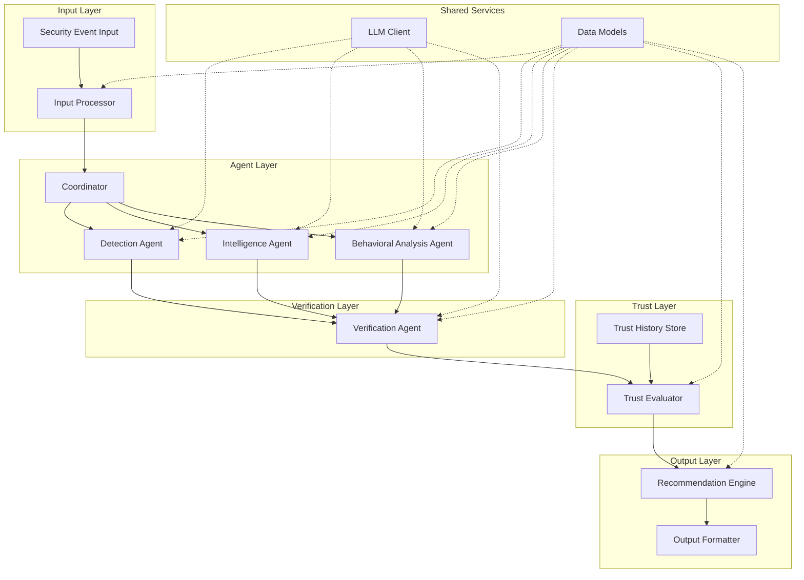

# System Architecture

This document provides detailed technical architecture information that extends `docs/ARCHITECTURE.md`. Where `ARCHITECTURE.md` describes the conceptual design, this document covers implementation-level details.

## Technology Stack

As decided in `docs/DECISIONS.md` (D-007):

| Category | Technology | Purpose |
|---|---|---|
| Language | Python 3.11 | Core implementation language |
| Data Validation | Pydantic | Structured data models, input/output validation |
| Testing | pytest | Unit and integration testing |
| LLM Integration | OpenAI SDK | Initial LLM API communication |
| Web Framework | FastAPI | API layer (only if required) |
| ML/Fine-Tuning | Hugging Face Transformers | Model loading, tokenization, inference |
| PEFT | PEFT library | Parameter-efficient fine-tuning adapters |
| Fine-Tuning | LoRA / QLoRA | Phase 2 parameter-efficient fine-tuning |
| Data Storage | JSON / JSONL | Event data, agent outputs, trust history |

## Project Structure

```
trust-aware-cyber-defense/
├── AGENTS.md                          # AI agent instructions
├── CONTRIBUTING.md                    # Contribution guidelines
├── CODE_OF_CONDUCT.md                 # Community standards
├── SECURITY.md                        # Security policy
├── README.md                          # Project overview
├── .github/
│   ├── PULL_REQUEST_TEMPLATE.md       # PR template
│   └── ISSUE_TEMPLATE/
│       └── ISSUE_TEMPLATE.md          # Issue templates
├── docs/
│   ├── PROJECT_SCOPE.md               # Problem, goals, phases, scope
│   ├── ARCHITECTURE.md                # Conceptual system design
│   ├── SYSTEM_ARCHITECTURE.md         # Technical architecture (this file)
│   ├── AGENT_DESIGN.md                # Agent design patterns
│   ├── TRUST_MODEL.md                 # Trust model overview
│   ├── DECISIONS.md                   # Decision log
│   ├── RESEARCH.md                    # Research foundation
│   ├── THREAT_MODEL.md                # Threats and mitigations
│   ├── LLM_FINE_TUNING.md            # Fine-tuning methodology
│   ├── DATASET.md                     # Dataset documentation
│   ├── API_REFERENCE.md              # API and schema reference
│   ├── TESTING.md                     # Testing strategy
│   ├── EXPERIMENTS.md                 # Experiment design and tracking
│   ├── DEVELOPMENT_GUIDE.md          # Developer setup guide
│   └── architecture/
│       ├── AGENT_SPECIFICATION.md     # Per-agent specification
│       ├── TRUST_MODEL.md            # Trust model implementation details
│       └── DATA_FLOW.md              # Data flow through the system
├── src/                               # Source code (TO BE CREATED)
│   ├── agents/                        # Agent implementations
│   │   ├── __init__.py
│   │   ├── base.py                   # Base agent class
│   │   ├── detection.py              # Detection Agent
│   │   ├── intelligence.py           # Intelligence Agent
│   │   ├── behavioral.py            # Behavioral Analysis Agent
│   │   └── verification.py          # Verification Agent
│   ├── coordinator/                   # Coordinator module
│   │   ├── __init__.py
│   │   └── coordinator.py           # Event dispatch and result collection
│   ├── trust/                         # Trust evaluation module
│   │   ├── __init__.py
│   │   ├── trust_model.py           # Trust score calculation
│   │   └── trust_history.py         # Historical accuracy tracking
│   ├── recommendation/               # Final recommendation module
│   │   ├── __init__.py
│   │   └── recommender.py           # Trust-weighted recommendation
│   ├── models/                        # Pydantic data models
│   │   ├── __init__.py
│   │   ├── events.py                # Security event schemas
│   │   ├── findings.py              # Agent finding schemas
│   │   ├── verification.py          # Verification result schemas
│   │   └── recommendation.py        # Final recommendation schemas
│   └── utils/                         # Shared utilities
│       ├── __init__.py
│       └── llm_client.py            # LLM API client wrapper
├── tests/                             # Test suite (TO BE CREATED)
│   ├── unit/
│   ├── integration/
│   └── scenarios/
├── data/                              # Data files (TO BE CREATED)
│   ├── events/                       # Sample security events
│   ├── threat_intel/                 # Threat intelligence data
│   ├── baselines/                    # Behavioral baselines
│   └── training/                     # Fine-tuning training data (Phase 2)
├── experiments/                       # Experiment results (TO BE CREATED)
├── requirements.txt                   # Python dependencies
└── pyproject.toml                     # Project configuration
```

> **Note:** The `src/`, `tests/`, `data/`, and `experiments/` directories do not exist yet. This structure is proposed and subject to team approval during implementation.

## Module Architecture

### Component Diagram



### Module Responsibilities

| Module | Responsibility | Dependencies |
|---|---|---|
| `src/agents/base.py` | Abstract base class defining agent interface | Pydantic models |
| `src/agents/detection.py` | Detection Agent — classifies security events | Base agent, LLM client |
| `src/agents/intelligence.py` | Intelligence Agent — correlates against threat intelligence | Base agent, LLM client, threat intel data |
| `src/agents/behavioral.py` | Behavioral Analysis Agent — compares against baselines | Base agent, LLM client, baseline data |
| `src/agents/verification.py` | Verification Agent — checks finding consistency | Base agent, LLM client (or plain code) |
| `src/coordinator/coordinator.py` | Dispatches events to agents, collects findings | All agent modules |
| `src/trust/trust_model.py` | Calculates trust scores from three factors | Trust history |
| `src/trust/trust_history.py` | Stores and retrieves historical accuracy data | JSON/JSONL storage |
| `src/recommendation/recommender.py` | Produces trust-weighted final recommendation | Trust model, data models |
| `src/models/` | Pydantic schemas for all data structures | Pydantic |
| `src/utils/llm_client.py` | Wrapper around LLM API calls | OpenAI SDK |

## Phase 1 Implementation

In Phase 1, the system is as simple as possible:

- **One LLM client** wrapping the OpenAI SDK (or compatible API), called with different role-specific prompts for each agent.
- **Verification** implemented as plain Python code (not LLM calls) unless the team decides otherwise.
- **Trust evaluation** implemented as plain Python code with the conceptual formula from `docs/architecture/TRUST_MODEL.md`.
- **Data storage** as JSON/JSONL files — no database.
- **No agent framework** — plain Python modules with a shared base class.

### Runtime Flow (Phase 1)

```
1. Load security event from JSON file
2. Input processor normalizes event into Pydantic model
3. Coordinator sends event to Detection, Intelligence, Behavioral Analysis
4. Each agent calls LLM with role-specific prompt → returns structured finding
5. Verification checks each finding against event evidence
6. Trust evaluator computes trust scores using verification + history + peer agreement
7. Recommender produces trust-weighted final recommendation
8. Output formatter presents recommendation with routing suggestion
```

## Phase 2 Implementation

Phase 2 reuses the same architecture. The **only** change is that one or more agents (TO BE DECIDED — see `docs/DECISIONS.md`, D-010) use a fine-tuned model instead of the base LLM:

- The `LLM Client` module supports loading either a base model via API or a locally loaded fine-tuned model via Hugging Face Transformers.
- The agent's code does not change — only the model it calls.
- This enables a direct Phase 1 vs. Phase 2 comparison.

## Configuration

Configuration is managed through environment variables and/or a simple configuration file:

| Setting | Description | Default |
|---|---|---|
| `LLM_API_KEY` | API key for the base LLM provider | Required (env var) |
| `LLM_MODEL` | Model identifier for base LLM | TO BE DECIDED |
| `TRUST_WEIGHTS` | Weights for trust factors (w1, w2, w3) | TO BE DECIDED |
| `CONFIDENCE_THRESHOLD` | Threshold for human review routing | TO BE DECIDED |
| `DATA_DIR` | Path to data files | `./data/` |
| `LOG_LEVEL` | Logging verbosity | `INFO` |

## Error Handling

- Agents that fail to produce valid structured output are treated as low-confidence/low-trust for that event.
- LLM API failures are caught and reported, not silently ignored.
- Invalid input events are rejected with clear error messages.
- All errors are logged with sufficient context for debugging.

## Safety Controls

- No module in the system can execute real actions against live infrastructure.
- The output layer produces simulated actions only (see `docs/DECISIONS.md`, D-011).
- API keys are never logged or included in output.
