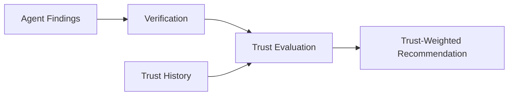
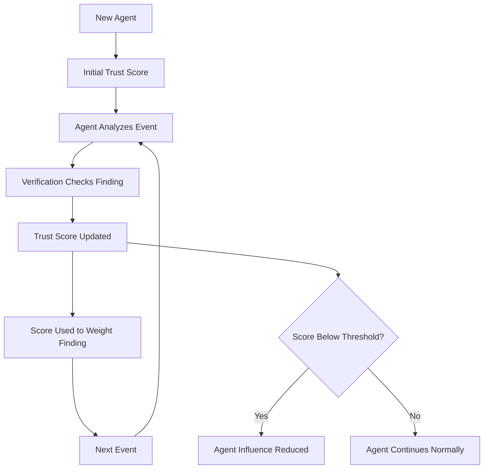

# Trust Model

This document provides a high-level overview of the trust model and its role in the system. For implementation-level details (conceptual formula, three factors, limitations), see `docs/architecture/TRUST_MODEL.md`.

## Why Trust Matters

In a multi-agent system where multiple specialized agents analyze the same security event, agents will sometimes disagree, and one or more may be wrong. Without trust-aware weighting, every agent's output counts equally — a consistently wrong agent has the same influence as a consistently correct one. The trust model gives the system a principled way to weight agent findings based on observable reliability signals rather than blind equality.

## Trust Model Goals

1. **Distinguish reliable from unreliable agents** — over time, agents that are consistently verified as correct should have more influence than those that are frequently wrong.
2. **Use observable signals, not self-reports** — trust is based on checkable external signals (verification results, historical accuracy, peer agreement), not on an agent's own stated confidence.
3. **Keep it simple and explainable** — the trust model must be simple enough for three students to implement, test, and defend in an academic presentation.
4. **Support demonstration** — the trust model should visibly affect at least one decision in a testable scenario (see `docs/PROJECT_SCOPE.md`, Success Criteria).

## Trust in the System Flow

The trust model sits between Verification and the Final Recommendation:



Verification result is used **exactly once** — as one input to the trust score. It is not applied again as a separate weight elsewhere. See `docs/architecture/TRUST_MODEL.md` for the detailed conceptual formula.

## The Three Trust Factors

| Factor | What It Measures | Source |
|---|---|---|
| Historical Accuracy | How often this agent's past findings turned out correct | Stored trust history (JSON/JSONL) |
| Verification Result | Whether this finding's cited evidence supports its conclusion | Verification Agent output |
| Peer Agreement | Whether this agent agrees with other high-trust agents | Cross-comparison of agent findings |

Each factor contributes to the trust score through a weighted combination. The weights (w1, w2, w3) are **TO BE DECIDED** — they will be tuned based on empirical results during testing.

## Trust Score Lifecycle



### Initial Trust

When an agent has no history (e.g., first event), it starts with a neutral trust score. The exact initial value is **TO BE DECIDED**.

### Trust Updates

After each event where a finding's correctness can be assessed:

1. Verification produces a result (consistent / inconsistent / inconclusive).
2. Peer agreement is calculated.
3. The trust score is updated using the weighted formula.
4. Updated scores are persisted to the trust history store.

### Low-Trust Behavior

If an agent's trust drops below a threshold (TO BE DECIDED), the system should reduce that agent's influence. Options being considered:

- **Simple down-weighting** — the agent's finding counts for less in the final recommendation.
- **Temporary quarantine** — the agent's finding is noted but excluded from the weighted decision.
- **Flagging** — the agent's low trust is surfaced in the recommendation for human review.

The team will decide which mechanism to use based on simplicity and demonstrability.

## Trust-Weighted Decision Making

The Final Recommendation combines agent findings weighted by their current trust scores:

```
Example (illustrative, not real results):

Detection Agent:     "suspicious_login" (trust: 0.8)  → weight: 0.8
Intelligence Agent:  "no known-bad match" (trust: 0.6) → weight: 0.6
Behavioral Agent:    "significant deviation" (trust: 0.9) → weight: 0.9

Trust-weighted conclusion: likely suspicious (influenced most by the
highest-trust agent's finding of significant behavioral deviation)
```

The exact aggregation method (weighted average, weighted vote, threshold-based exclusion) is **TO BE DECIDED**.

## Demonstrating Trust Impact

To meet the project's success criteria, the team needs at least one demonstrable scenario where trust weighting changes the final decision:

1. **Scenario:** Introduce a deliberately wrong or unreliable agent finding.
2. **Without trust:** The wrong finding has equal influence, producing a potentially incorrect recommendation.
3. **With trust:** The unreliable agent's low trust score reduces its influence, producing a better recommendation.

This demonstration is planned as part of the experimental evaluation — see `docs/EXPERIMENTS.md`.

## Integration Points

| Component | How It Uses Trust |
|---|---|
| Verification Agent | Produces verification results that feed into trust scores |
| Trust History Store | Persists and retrieves historical accuracy data |
| Trust Evaluator | Computes trust scores using the three factors |
| Recommendation Engine | Weights agent findings by trust scores |
| Final Recommendation | Includes trust scores in the output for transparency |

## Limitations

Documented in detail in `docs/architecture/TRUST_MODEL.md`:

- Small sample sizes make trust scores statistically thin.
- Verification itself can be wrong, leading to incorrect trust updates.
- Trust scores are a heuristic, not a certified measure of reliability.
- With few agents and few events, the trust model's value is demonstrative rather than statistically rigorous.

## Related Documentation

- `docs/architecture/TRUST_MODEL.md` — Implementation-level details (conceptual formula, three factors, limitations).
- `docs/ARCHITECTURE.md` — How trust fits in the overall system flow.
- `docs/architecture/DATA_FLOW.md` — Data flow through trust evaluation.
- `docs/THREAT_MODEL.md` — Threat: Trust Manipulation.
- `docs/EXPERIMENTS.md` — Planned experiments involving trust.
