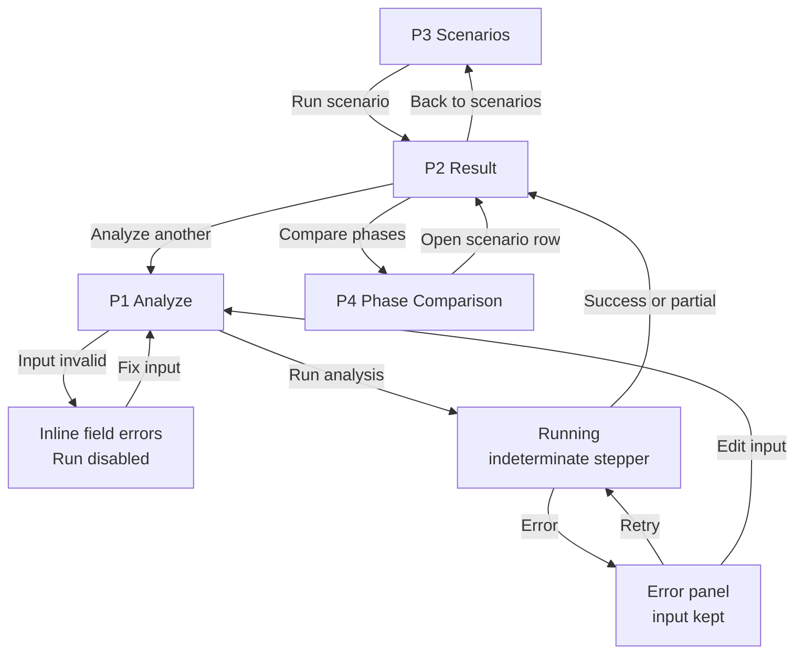

# Frontend Specification — Pages, User Flow and Result States

Owner: Member 3 (Frontend & Product) · Day 1, Phase 2 of 3 · Status: **PROPOSED — for team review**

This document defines **what the frontend shows and how a user moves through it**. It is technology-agnostic: the frontend stack is still undecided (DOC_REVIEW G-01), and the wireframes are layout sketches, not visual designs.

Every element traces back to a requirement in `DOC_REVIEW.md` (R-01 – R-24). Data fields marked *(proposed)* do not exist in the current schema (`docs/API_REFERENCE.md`); they are specified in Phase 3 (`SCHEMA_PROPOSAL.md`).

## 1. Purpose and Users

**Goal:** make one run of the multi-agent pipeline *explainable at a glance*. A viewer should be able to answer four questions:

1. What did each agent conclude?
2. Did its evidence hold up?
3. How much was it trusted?
4. Why did the system reach its final recommendation, and did trust change it?

| User | Needs | Main pages |
|---|---|---|
| Evaluator / mentor (demo audience) | Understand the idea in ~3 minutes; see trust visibly matter | Scenarios, Result, Phase Comparison |
| Team member (M1/M2/M3) | Run events, debug outputs, record experiments | Analyze, Result (raw data), Phase Comparison |

**Out of scope:** user accounts, live alert feeds, real response actions, alert queues or any SOC-product features (PROJECT_SCOPE, D-011).

## 2. Global Product Rules

These apply to every page. The full wording is in DOC_REVIEW §3.

| Rule | UI consequence | Req. |
|---|---|---|
| Actions are simulated | Action text always reads "Simulated — would …". A **SIMULATED** badge sits next to every action. No button ever triggers an action. | R-01 |
| No match ≠ benign | Intelligence "no match" is a grey "No known indicator" chip, never green | R-02 |
| No baseline ≠ normal | Behavioral "no baseline" is a grey "No baseline available" chip | R-03 |
| Trust ≠ probability | Trust is shown as a 0.00–1.00 score with the tooltip "Weighting heuristic — not a probability of being correct". Never shown as "%". | R-04 |
| Disagreement is visible | A disagreement callout sits above the fold on the Result page | R-05 |
| Uncertainty stays uncertain | Low confidence and human-review results never get a "success" style | R-06 |
| Label synthetic and mock data | SYNTHETIC tag on events; MOCK banner on mock results | R-07 |
| Untrusted content is text only | `raw_content`, evidence and reasoning are rendered as escaped plain text in a monospace block | R-08 |
| Colour is never the only signal | Every coloured state also has an icon and a text label | R-24 |

## 3. Site Map

| # | Page | Priority | Purpose | Req. |
|---|---|---|---|---|
| P1 | Analyze | **MVP** | Pick, paste or upload an event and run the pipeline | R-20, R-22 |
| P2 | Result | **MVP** | Full explanation of one run — the core demo screen | R-11 – R-16, R-18, R-19 |
| P3 | Scenarios | **MVP** | Prepared demo scenarios, one click to run | R-21, R-23 |
| P4 | Phase Comparison | **MVP** (data from Day 8) | Phase 1 vs Phase 2 results | R-17, R-10 |
| P5 | Trust History | Stretch | Each agent's trust score across runs | R-14 (needs G-14) |
| P6 | How It Works | Stretch | Static pipeline explainer for presentations | R-11 |

**Global layout:** a top bar with the project name, nav links (Scenarios · Analyze · Phase Comparison), and a **MOCK MODE** pill whenever the app is reading fixtures instead of the backend (R-23).

## 4. User Flow



### Demo path (≈3 minutes)

| Step | Page | Shows | Req. |
|---|---|---|---|
| 1 | P3 | "Here are prepared, synthetic scenarios" | R-07, R-21 |
| 2 | P2 — Clear attack | Agents agree, evidence verified → **simulated** action | R-01, R-12 – R-15 |
| 3 | P2 — Trust flip | A misleading agent: equal weighting says benign, trust weighting says malicious → human review | R-16 (headline) |
| 4 | P2 — Ambiguous | Disagreement + "no match" → human review | R-02, R-05, R-06 |
| 5 | P4 | Phase 1 vs Phase 2 with sample-size caveat | R-10, R-17 |

## 5. Page Specifications

### P1 — Analyze

**Purpose:** get a valid `SecurityEvent` into the pipeline.

```
┌──────────────────────────────────────────────────────────────┐
│ Trust-Aware Cyber Defense   Scenarios  Analyze  Compare  MOCK│
├──────────────────────────────────────────────────────────────┤
│ Analyze a security event                                     │
│ [ Sample scenario ] [ Paste JSON ] [ Upload .json ]  ← tabs  │
│ ┌──────────────────────────────┐ ┌─────────────────────────┐ │
│ │ { "event_id": "evt-002",     │ │ EVENT PREVIEW  SYNTHETIC│ │
│ │   "event_type": ...          │ │ Type     network_flow   │ │
│ │   ...                        │ │ Source   10.0.4.77      │ │
│ │ }                            │ │ Dest     198.51.100.20  │ │
│ │                              │ │ Entity   laptop-fin-07  │ │
│ │ ✗ timestamp: not ISO 8601    │ │ Raw  ┌───────────────┐  │ │
│ └──────────────────────────────┘ │      │ plain text    │  │ │
│                                  │      └───────────────┘  │ │
│ Phase: (•) Phase 1 base LLM      └─────────────────────────┘ │
│        ( ) Phase 2 fine-tuned  ⓘ available after M2 delivers │
│                                         [ Run analysis ▶ ]   │
└──────────────────────────────────────────────────────────────┘
```

| Element | Behaviour | Req. |
|---|---|---|
| Input tabs | Sample (dropdown of P3 scenarios), paste JSON, upload `.json` | R-20 |
| Validation | Required: `event_id`, `timestamp` (ISO 8601), `event_type`, `raw_content`. Optional fields are validated if present (IP format, port 0–65535). Errors appear inline per field. | R-20 |
| Event preview | Parsed fields; `raw_content` in an escaped monospace block; SYNTHETIC tag if `metadata.source = "SYNTHETIC"` | R-07, R-08 |
| Phase selector | Phase 2 is disabled, with a tooltip, until a fine-tuned model is integrated | R-17 |
| Run button | Disabled until the input is valid; disabled while running | R-22 |

Detailed validation rules are in Phase 3.

### P2 — Result (core screen)

**Purpose:** explain one run, top to bottom, in the order the pipeline ran.

```
┌──────────────────────────────────────────────────────────────┐
│ ◀ Back   evt-002 · 2026-09-21 14:03 · Phase 1 · base-llm     │
│          run mock-run-002   [SYNTHETIC] [MOCK]               │
├──────────────────────────────────────────────────────────────┤
│ Input ✓ ─ Agents ✓✓✓ ─ Verification ✓ ─ Trust ✓ ─ Result ✓   │ ← stepper
├──────────────────────────────────────────────────────────────┤
│ ▌FINAL RECOMMENDATION                                        │
│ ▌⬤ MALICIOUS · exfil_volume_anomaly                          │
│ ▌Confidence ▮▯▯ low (0.51)      Routing: 👤 HUMAN REVIEW     │
│ ▌Why: winning share 0.51 below threshold 0.60                │
├──────────────────────────────────────────────────────────────┤
│ ⚠ Agents disagree: detection → benign · intelligence →       │
│   benign · behavioral → malicious                            │
├──────────────────────────────────────────────────────────────┤
│ TRUST IMPACT                  ★ Trust weighting changed the  │
│ Equal-weighted     BENIGN     │ outcome                      │
│   benign ██████████ 2.00      │                              │
│   malic. █████ 1.00           │                              │
│ Trust-weighted     MALICIOUS  │                              │
│   benign ██████▌ 0.655        │                              │
│   malic. ██████▉ 0.690        │                              │
├──────────────────────────────────────────────────────────────┤
│ ┌ DETECTION ────────┐ ┌ INTELLIGENCE ─────┐ ┌ BEHAVIORAL ───┐│
│ │ ⬤ BENIGN          │ │ ⬤ BENIGN          │ │ ⬤ MALICIOUS   ││
│ │ normal_https      │ │ allowlisted_cdn   │ │ exfil_volume… ││
│ │ Conf ▮▮▮ high     │ │ Conf ▮▯▯ low      │ │ Conf ▮▮▮ high ││
│ │ Evidence:         │ │ Evidence: ...     │ │ Evidence: ... ││
│ │ "known update     │ │                   │ │               ││
│ │  server"          │ │                   │ │               ││
│ │ ✗ INCONSISTENT    │ │ ? INCONCLUSIVE    │ │ ✓ CONSISTENT  ││
│ │ cited text not in │ │ /24 match only    │ │ fields match  ││
│ │ event             │ │                   │ │               ││
│ │ Trust 0.23        │ │ Trust 0.43        │ │ Trust 0.69    ││
│ │ ▓▓▓░░░ hist·ver·peer│ ▓▓▓▓░░          │ │ ▓▓▓▓▓▓        ││
│ │ ▸ Reasoning       │ │ ▸ Reasoning       │ │ ▸ Reasoning   ││
│ └───────────────────┘ └───────────────────┘ └───────────────┘│
├──────────────────────────────────────────────────────────────┤
│ ▸ Settings used: w = 0.40 / 0.35 / 0.25 · threshold 0.60     │
│ ▸ Raw data (event JSON · result JSON)             [ Copy ]   │
│ [ Analyze another ]   [ Compare phases ]                     │
└──────────────────────────────────────────────────────────────┘
```

Sections in reading order:

| # | Section | Content | Req. |
|---|---|---|---|
| 1 | Header | event_id, timestamp, phase/model *(proposed)*, run_id *(proposed)*, SYNTHETIC/MOCK tags | R-07, R-17 |
| 2 | Pipeline stepper | Input → Agents (3, parallel) → Verification → Trust → Result; each step ✓ / ✗ / partial | R-11 |
| 3 | Final recommendation | Verdict *(proposed)* + classification, confidence label + value *(proposed)*, routing chip, routing reason *(proposed)*. If simulated_action: a SIMULATED action box ("Simulated — would …"). | R-01, R-06, R-15 |
| 4 | Disagreement callout | Only shown when agents disagree; lists each agent's verdict | R-05 |
| 5 | Trust impact | Equal-weighted vs trust-weighted verdict with weight bars *(proposed)*; ★ banner when `trust_changed_outcome`; "Tie — no majority" when tied | R-16 |
| 6 | Agent cards ×3 | Verdict chip, classification, confidence, quoted evidence, verification badge + reason *(proposed)*, trust score + 3-factor stacked bar, reasoning (collapsed) | R-12 – R-14, R-18 |
| 7 | Settings used | Weights and threshold for this run (collapsed) | R-19 |
| 8 | Raw data | Event + result JSON, escaped, with copy button (collapsed) | R-08 |
| 9 | Actions | Analyze another · Compare phases | — |

**Trust bar detail (R-04, R-14).** The stacked bar shows the contribution of each factor to `total_score`: `w1 × historical accuracy`, `w2 × verification`, `w3 × peer agreement`. Hovering a segment shows the raw factor value and its weight. The score is always displayed as a decimal (0.69), never "69%".

**Card order** is fixed (Detection, Intelligence, Behavioral) so viewers can compare runs. Cards stack vertically on narrow screens.

### P3 — Scenarios

```
┌──────────────────────────────────────────────────────────────┐
│ Demo scenarios                          All data is SYNTHETIC│
│ ┌──────────────────┐ ┌──────────────────┐ ┌──────────────────┐│
│ │ Clear attack     │ │ Trust flip ★     │ │ Ambiguous login  ││
│ │ SSH brute force  │ │ Misleading agent │ │ Agents disagree  ││
│ │ Shows: simulated │ │ Shows: trust     │ │ Shows: human     ││
│ │ action           │ │ changes outcome  │ │ review, no match ││
│ │        [ Run ▶ ] │ │        [ Run ▶ ] │ │        [ Run ▶ ] ││
│ └──────────────────┘ └──────────────────┘ └──────────────────┘│
└──────────────────────────────────────────────────────────────┘
```

Each card shows a title, a one-line description and "Shows: …" (what it demonstrates), plus a Run button that opens P2.

Target scenario set (R-21, from TESTING.md). The first three are delivered as fixtures in Phase 3; the others are added once the backend can produce them:

| Scenario | Demonstrates | Expected routing |
|---|---|---|
| Clear attack | All agree, verified | Simulated action |
| Trust flip | Misleading agent; trust changes outcome | Human review |
| Ambiguous | Disagreement, "no match" | Human review |
| Missing data | No IOC match / no baseline shown correctly | Human review or further verification |
| Agent failure | Partial result with 2 of 3 agents | Human review |
| Benign event | Agents agree it is benign | Further verification |

### P4 — Phase Comparison

```
┌──────────────────────────────────────────────────────────────┐
│ Phase 1 vs Phase 2          Test set: N = {n} events         │
│ ⓘ Small test set — results are indicative, not statistically │
│   rigorous.                                                  │
│ ┌──────────────────────┬─────────┬─────────┬──────────┐      │
│ │ Metric               │ Phase 1 │ Phase 2 │ Δ        │      │
│ ├──────────────────────┼─────────┼─────────┼──────────┤      │
│ │ (metrics from M2)    │   …     │   …     │  …       │      │
│ └──────────────────────┴─────────┴─────────┴──────────┘      │
│ Per-scenario                                                 │
│ Event    │ P1 verdict │ P2 verdict │ Changed? │ [Open]       │
└──────────────────────────────────────────────────────────────┘
```

- The metric list is **not hardcoded**: the table renders whatever metrics M2 reports (EXPERIMENTS.md candidates, TBD). R-10, R-17.
- Sample size and a caveat are always visible (R-10).
- The fine-tuned agent(s) are named from the data, never assumed (D-010).
- Before Day 8, the page shows its empty state. It never shows placeholder numbers.

### P5 — Trust History (stretch)

Line chart of `total_score` per agent across runs, plus a table of runs. It needs persisted trust history (DOC_REVIEW G-14). If there is no history, the page shows its empty state.

### P6 — How It Works (stretch)

Static version of the ARCHITECTURE.md diagram with one sentence per stage, for use in the presentation.

## 6. Result States

### 6.1 Page-level states

| State | Trigger | UI | Req. |
|---|---|---|---|
| Idle | No input yet | P1 empty form + "Pick a sample scenario to start" | — |
| Invalid input | Validation fails | Inline field errors; Run disabled | R-20 |
| Running | Request in flight | Indeterminate stepper, Run disabled, input read-only | R-22 |
| Success | Valid result, all agents ok | Full P2 | R-11 – R-16 |
| Partial | ≥ 1 agent failed | P2 renders; failed card shows "✗ Agent failed" + error text; stepper step marked partial; banner note "Based on 2 of 3 agents" | R-18 |
| All agents failed | Every agent failed | P2 shows an error panel instead of a recommendation. There is no fake result. | R-06, R-22 |
| Error | Backend unreachable, timeout, schema error | Error panel with message + Retry; input preserved | R-22 |
| Empty | P4/P5 with no data | "No results recorded yet" — never placeholder numbers | R-10 |
| Mock mode | App reading fixtures | MOCK MODE pill in the top bar + MOCK tag on results | R-07, R-23 |

The pipeline is synchronous (SYSTEM_ARCHITECTURE), so "Running" is indeterminate for MVP. Real per-stage progress needs streaming and is stretch.

### 6.2 Value → display mapping

| Field | Value | Display |
|---|---|---|
| verdict *(proposed)* | malicious | ⬤ red "MALICIOUS" |
| | suspicious | ▲ amber "SUSPICIOUS" |
| | benign | ● green "BENIGN" |
| | unknown | ○ grey "UNKNOWN" (or "No known indicator" / "No baseline available" per R-02/R-03) |
| confidence | high / medium / low / none | ▮▮▮ / ▮▮▯ / ▮▯▯ / ▯▯▯ + label |
| verification status | verified_consistent | ✓ green "CONSISTENT" |
| | verified_inconsistent | ✗ red "INCONSISTENT" |
| | inconclusive | ? grey "INCONCLUSIVE" |
| routing | simulated_action | ⚙ "SIMULATED ACTION" + SIMULATED badge |
| | further_verification | 🔍 "FURTHER VERIFICATION" |
| | human_review | 👤 "HUMAN REVIEW" |
| trust score | 0.00 – 1.00 | Two decimals + 3-segment bar; never % |
| weighting tie *(proposed)* | tie | "Tie — no majority" in grey |
| agent error *(proposed)* | present | ✗ "Agent failed" + message; greyed card |

Final colours and icons are set during the Day 2 scaffold. The rule that fixes them now: **icon + text + colour, never colour alone** (R-24).

## 7. Requirement Coverage

| Req. | Covered by | | Req. | Covered by |
|---|---|---|---|---|
| R-01 | §2, P2 §3, 6.2 | | R-13 | P2 cards |
| R-02 | §2, 6.2 | | R-14 | P2 cards, trust bar |
| R-03 | §2, 6.2 | | R-15 | P2 §3 |
| R-04 | §2, trust bar | | R-16 | P2 §5 Trust impact |
| R-05 | P2 §4 | | R-17 | P2 header, P4 |
| R-06 | §2, 6.1 | | R-18 | P2 cards, 6.1 Partial |
| R-07 | §2, P1, P2, P3 | | R-19 | P2 §7 |
| R-08 | §2, P1, P2 §8 | | R-20 | P1 |
| R-09 | Phase 3 / implementation (no UI element) | | R-21 | P3 |
| R-10 | P4, 6.1 Empty | | R-22 | P1, 6.1 |
| R-11 | P2 stepper, P6 | | R-23 | Global MOCK pill, 6.1 |
| R-12 | P2 cards | | R-24 | §2, 6.2 |

## 8. Open Items

These are carried over from DOC_REVIEW and don't block this spec.

- **G-01 Stack:** the wireframes fit either Streamlit or a React SPA. The Streamlit version would use `st.columns` for the cards and `st.expander` for the collapsed sections.
- **G-03 – G-09 Schema:** the *(proposed)* fields above are specified in Phase 3.
- **G-11:** the stepper draws the agents as parallel. It will be updated if the team decides agents see each other's findings.
- **G-13:** routing and tie rules are displayed, not defined, by the UI.
